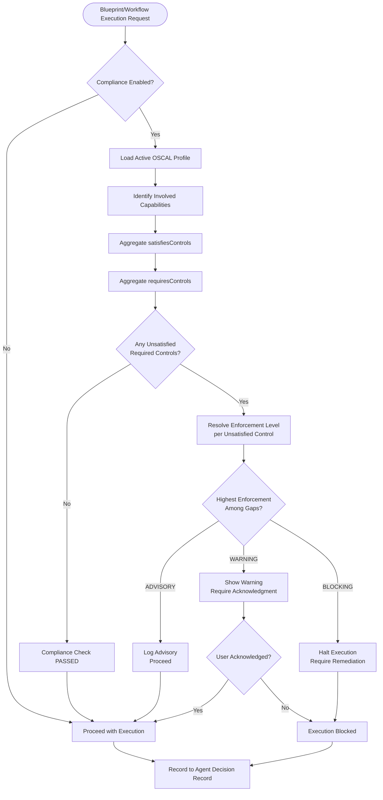

# ADR-001: OSCAL Compass Integration — Data Schema & Enforcement Logic

| Metadata | Value |
| --- | --- |
| ID | ADR-001 |
| Version | 1.0.0 |
| Status | PROPOSED |
| Authors | Platform Engineering |
| Date | 2026-02-01 |
| Context | Compliance-as-Code runtime integration |
| Supersedes | — |

---

## 1. Decision Summary

Integrate [OSCAL Compass](https://github.com/oscal-compass) tooling as **first-class runtime primitives** in the Harmony platform, enabling:

1. **Opt-in compliance tracking** per tenant via configuration
2. **Configurable enforcement** (ADVISORY, WARNING, BLOCKING) at execution time
3. **Auto-generated SSPs** with human override support and approval workflows
4. **Real-time Compliance Dashboard** in the portal

This ADR defines the **data schemas** and **enforcement logic** that underpin this integration.

---

## 2. Context & Problem Statement

### 2.1 Current State

- The Open Capability Standard (OCS) includes an optional `oscalControlIds` field, but it's unused
- Certification (`CERTIFICATION.json`) is a flat pass/fail report with no OSCAL interoperability
- No mechanism exists to enforce compliance requirements at execution time
- Compliance posture is invisible to operators and agents

### 2.2 Desired State

- Capabilities, blueprints, and skills declare which OSCAL controls they satisfy
- Execution pipelines can enforce compliance requirements before allowing operations
- Generated SSPs can be exported for auditor review
- A portal dashboard visualizes coverage, gaps, and assessment history

---

## 3. Decision Drivers

| Driver | Weight | Rationale |
|--------|--------|-----------|
| Regulatory readiness | High | FedRAMP, SOC 2, ISO 27001 require documented controls |
| Audit efficiency | High | Auto-generated SSPs save hundreds of manual hours |
| Runtime guardrails | High | Prevent non-compliant operations in production |
| Developer experience | Medium | Opt-in, non-disruptive adoption path |
| Agent intelligence | Medium | Agents can reason about compliance |

---

## 4. Data Schemas

### 4.1 Enforcement Level Enum

```typescript
/**
 * Determines how compliance gaps affect execution.
 */
export type ComplianceEnforcementLevel = 'ADVISORY' | 'WARNING' | 'BLOCKING';

// ADVISORY: Log gaps, proceed without interruption
// WARNING:  Log gaps, require acknowledgment, proceed
// BLOCKING: Halt execution, require remediation or approval
```

---

### 4.2 Control Mapping Schema

Embedded in each Capability's `security` block:

```typescript
/**
 * Rich compliance metadata for a Capability.
 * Replaces the flat `oscalControlIds?: string[]` field.
 */
export interface CapabilityCompliance {
  /**
   * NIST/OSCAL Control IDs this capability helps satisfy.
   * Maps to OSCAL Component Definition "implemented-requirements".
   * @example ["AC-2", "AC-6(1)", "AU-3"]
   */
  satisfiesControls: string[];

  /**
   * Controls that MUST be satisfied before this capability can execute.
   * Checked at runtime by the Compliance Advisor.
   * @example ["IA-2"] // Requires authentication control
   */
  requiresControls?: string[];

  /**
   * Pointer to the SSP section with implementation narrative.
   * Enables bidirectional linking between code and documentation.
   * @example "ssp://ac-2/implementation/capability-rbac-enforcer"
   */
  implementationRef?: string;

  /**
   * Evidence artifacts this capability produces.
   * Linked in OSCAL Assessment Results.
   * @example ["audit-log://access-control-events"]
   */
  producesEvidence?: string[];
  
  /**
   * Version of the control mapping. Incremented when mappings change.
   * Used to detect stale SSP data (see §5.3 Staleness Detection).
   */
  mappingVersion: number;
}
```

**JSON Schema (for validation):**

```json
{
  "$schema": "https://json-schema.org/draft/2020-12/schema",
  "$id": "harmony://schemas/capability-compliance.json",
  "type": "object",
  "properties": {
    "satisfiesControls": {
      "type": "array",
      "items": { "type": "string", "pattern": "^[A-Z]{2}-[0-9]+.*$" },
      "minItems": 0
    },
    "requiresControls": {
      "type": "array",
      "items": { "type": "string", "pattern": "^[A-Z]{2}-[0-9]+.*$" }
    },
    "implementationRef": { "type": "string", "format": "uri" },
    "producesEvidence": {
      "type": "array",
      "items": { "type": "string", "format": "uri" }
    },
    "mappingVersion": { "type": "integer", "minimum": 1 }
  },
  "required": ["satisfiesControls", "mappingVersion"]
}
```

---

### 4.3 Tenant Compliance Configuration

```typescript
/**
 * Per-tenant compliance configuration.
 * Stored in tenant settings, drives runtime behavior.
 */
export interface TenantComplianceConfig {
  /** Master switch for compliance features */
  enabled: boolean;

  /** OSCAL Profile ID to use for this tenant */
  profileId: string; // e.g., "nist-800-53-moderate", "fedramp-moderate"

  /** Default enforcement level for all controls */
  defaultEnforcement: ComplianceEnforcementLevel;

  /**
   * Per-family overrides for enforcement level.
   * Takes precedence over defaultEnforcement.
   */
  familyOverrides: {
    family: string;  // e.g., "AC", "AU", "SC"
    enforcement: ComplianceEnforcementLevel;
  }[];

  /**
   * Per-control overrides (most specific).
   */
  controlOverrides: {
    controlId: string;
    enforcement: ComplianceEnforcementLevel;
  }[];

  /** SSP generation settings */
  ssp: {
    autoGenerate: boolean;
    /** Control families where human edits require approval */
    approvalRequiredFamilies: string[];
    /** Polling interval for staleness check (minutes) */
    stalenessCheckIntervalMinutes: number;
  };
}
```

**Example Configuration:**

```yaml
# harmony.config.yaml
compliance:
  enabled: true
  profileId: "nist-800-53-moderate"
  defaultEnforcement: ADVISORY
  familyOverrides:
    - family: AC
      enforcement: BLOCKING
    - family: SC
      enforcement: WARNING
  controlOverrides:
    - controlId: AC-2
      enforcement: BLOCKING
  ssp:
    autoGenerate: true
    approvalRequiredFamilies: [AC, IA, SC, AU]
    stalenessCheckIntervalMinutes: 60
```

---

### 4.4 SSP Section Schema

```typescript
/**
 * Represents a single control implementation section in the SSP.
 * Tracks auto-generated vs human-edited content.
 */
export interface SSPControlSection {
  controlId: string;
  
  /** Content source tracking */
  source: {
    /** Auto-generated from capability metadata */
    autoGenerated: {
      narrative: string;
      generatedAt: string; // ISO timestamp
      sourceCapabilities: string[]; // Capability IDs that contributed
      mappingVersions: Record<string, number>; // capabilityId -> mappingVersion
    };
    
    /** Human-authored override (if any) */
    humanOverride?: {
      narrative: string;
      editedBy: string;
      editedAt: string;
      
      /** Approval status for security-critical families */
      approval?: {
        required: boolean;
        status: 'PENDING' | 'APPROVED' | 'REJECTED';
        approvedBy?: string;
        approvedAt?: string;
        comments?: string;
      };
    };
  };
  
  /** Staleness indicator (see §5.3) */
  stale: boolean;
  staleReason?: string;
  
  /** Evidence links */
  evidenceLinks: string[];
  
  /** Responsibility assignment */
  responsibleRoles: string[];
}
```

---

### 4.5 Compliance Check Result

Returned by the Compliance Advisor before execution:

```typescript
/**
 * Result of a pre-execution compliance check.
 */
export interface ComplianceCheckResult {
  /** Can the operation proceed? */
  canProceed: boolean;
  
  /** Effective enforcement level for this operation */
  enforcementLevel: ComplianceEnforcementLevel;
  
  /** Controls that are satisfied by the involved capabilities */
  satisfiedControls: {
    controlId: string;
    satisfiedBy: string[]; // Capability IDs
  }[];
  
  /** Controls required but not satisfied */
  unsatisfiedControls: {
    controlId: string;
    requiredBy: string; // Capability that declared the requirement
    enforcementLevel: ComplianceEnforcementLevel;
    recommendations: string[]; // Suggested capabilities to add
  }[];
  
  /** If blocked, why? */
  blockReason?: string;
  
  /** Actions user can take */
  remediationOptions: {
    type: 'ADD_CAPABILITY' | 'REQUEST_APPROVAL' | 'ACKNOWLEDGE_WARNING';
    description: string;
    actionPayload: unknown;
  }[];
  
  /** Attestation requirement */
  attestationRequired: boolean;
  attestationMessage?: string;
}
```

---

### 4.6 Agent Decision Record Extension

Extends the existing ADR-AGENT-001 schema:

```typescript
/**
 * Compliance context added to Agent Decision Records.
 */
export interface AgentDecisionComplianceContext {
  /** Profile in effect at decision time */
  activeProfileId: string;
  
  /** Enforcement level in effect */
  enforcementLevel: ComplianceEnforcementLevel;
  
  /** Controls this decision addresses */
  addressesControls: string[];
  
  /** Controls required but not yet satisfied */
  outstandingControls: string[];
  
  /** Was execution blocked? */
  blocked: boolean;
  
  /** Block reason if blocked */
  blockReason?: string;
  
  /** Acknowledgments made (for WARNING level) */
  acknowledgments: {
    controlId: string;
    acknowledgedBy: string;
    acknowledgedAt: string;
  }[];
}
```

---

## 5. Enforcement Logic

### 5.1 Enforcement Resolution Algorithm

```
function resolveEnforcementLevel(controlId: string, config: TenantComplianceConfig): ComplianceEnforcementLevel {
  // 1. Check control-specific override (most specific)
  const controlOverride = config.controlOverrides.find(o => o.controlId === controlId);
  if (controlOverride) return controlOverride.enforcement;
  
  // 2. Check family override
  const family = controlId.substring(0, 2); // e.g., "AC" from "AC-2"
  const familyOverride = config.familyOverrides.find(o => o.family === family);
  if (familyOverride) return familyOverride.enforcement;
  
  // 3. Fall back to tenant default
  return config.defaultEnforcement;
}
```

### 5.2 Pre-Execution Compliance Check Flow



### 5.3 Staleness Detection

**Problem:** If a capability updates its `satisfiesControls` but the SSP isn't regenerated, the dashboard lies.

**Solution:** Track `mappingVersion` and compare on every SSP read.

```typescript
/**
 * Check if an SSP section is stale due to capability changes.
 */
function checkStaleness(section: SSPControlSection, capabilityRegistry: CapabilityRegistry): StalenessResult {
  for (const [capId, recordedVersion] of Object.entries(section.source.autoGenerated.mappingVersions)) {
    const capability = capabilityRegistry.get(capId);
    if (!capability) {
      return { stale: true, reason: `Capability ${capId} no longer exists` };
    }
    
    const currentVersion = capability.security.compliance?.mappingVersion ?? 0;
    if (currentVersion > recordedVersion) {
      return { 
        stale: true, 
        reason: `Capability ${capId} control mappings updated (${recordedVersion} → ${currentVersion})` 
      };
    }
  }
  
  return { stale: false };
}

// On Dashboard load or SSP read:
// 1. For each SSPControlSection, run checkStaleness()
// 2. If stale, set section.stale = true and section.staleReason
// 3. Display "Re-sync Required" banner in UI
```

**UI Indicator:**

```
┌─────────────────────────────────────────────────────────────┐
│  ⚠️ 3 SSP sections are stale due to capability updates      │
│  [Review Changes]  [Auto-Regenerate]                        │
└─────────────────────────────────────────────────────────────┘
```

### 5.4 SSP Narrative Merge Strategy

**Problem:** When auto-generated content changes significantly, naive overwrite loses human context.

**Solution:** Three-way merge with conflict detection.

```typescript
interface SSPNarrativeMerge {
  /** Original auto-generated (at time human edited) */
  base: string;
  
  /** Current auto-generated (from latest capabilities) */
  incoming: string;
  
  /** Human override */
  humanOverride: string;
}

function mergeNarratives(merge: SSPNarrativeMerge): MergeResult {
  // 1. If no human override, use incoming directly
  if (!merge.humanOverride) {
    return { result: merge.incoming, hasConflict: false };
  }
  
  // 2. If base === incoming, no auto-gen changes, keep human
  if (merge.base === merge.incoming) {
    return { result: merge.humanOverride, hasConflict: false };
  }
  
  // 3. Compute diffs
  const baseToIncoming = computeDiff(merge.base, merge.incoming);
  const baseToHuman = computeDiff(merge.base, merge.humanOverride);
  
  // 4. Check for conflicts (both modified same region)
  const conflicts = findConflictingRegions(baseToIncoming, baseToHuman);
  
  if (conflicts.length === 0) {
    // Auto-merge possible
    return { 
      result: applyNonConflictingMerge(merge.base, baseToIncoming, baseToHuman),
      hasConflict: false 
    };
  }
  
  // 5. Conflict detected → require human resolution
  return {
    result: null,
    hasConflict: true,
    conflicts: conflicts.map(c => ({
      region: c,
      autoVersion: extractRegion(merge.incoming, c),
      humanVersion: extractRegion(merge.humanOverride, c)
    }))
  };
}
```

**Conflict Resolution UI:**

```
┌─────────────────────────────────────────────────────────────┐
│  AC-2 Implementation Narrative - Merge Required             │
├─────────────────────────────────────────────────────────────┤
│  <<<<<<< Auto-Generated (New)                               │
│  This control is satisfied by the rbac-enforcer capability  │
│  which enforces role-based access using Keycloak policies.  │
│  =======                                                    │
│  This control is satisfied through our RBAC implementation  │
│  with quarterly access reviews conducted by the Security    │
│  team as documented in HR-POL-003.                          │
│  >>>>>>> Your Version                                       │
├─────────────────────────────────────────────────────────────┤
│  [Use Auto] [Use Yours] [Edit Merged]                       │
└─────────────────────────────────────────────────────────────┘
```

### 5.5 Compliance Advisor Caching

**Problem:** Resolving large NIST 800-53 profiles on every agent decision is expensive.

**Solution:** Multi-layer caching with intelligent invalidation.

```typescript
interface ComplianceCatalogCache {
  /**
   * Layer 1: Full catalog (rarely changes)
   * TTL: 24 hours or until explicit invalidation
   */
  catalogs: Map<string, {
    data: OscalCatalog;
    loadedAt: number;
    ttl: number;
  }>;
  
  /**
   * Layer 2: Resolved profiles (changes when catalog or profile changes)
   * TTL: 1 hour
   */
  resolvedProfiles: Map<string, {
    data: ResolvedControlSet;
    sourceHash: string; // Hash of catalog + profile
    loadedAt: number;
    ttl: number;
  }>;
  
  /**
   * Layer 3: Capability → Controls index (changes on capability update)
   * TTL: 5 minutes (or on capability change webhook)
   */
  capabilityControlIndex: Map<string, {
    satisfies: string[];
    requires: string[];
    mappingVersion: number;
  }>;
}

// Cache invalidation triggers:
// - Catalog import → clear L1, L2
// - Profile update → clear L2
// - Capability update → clear L3 for that capability
// - Tenant config change → clear L2 for that profile
```

**Performance Targets:**

| Operation | Target Latency | Caching Layer |
|-----------|----------------|---------------|
| Catalog lookup | < 5ms | L1 (memory) |
| Profile resolution | < 50ms | L2 (memory) |
| Capability control check | < 2ms | L3 (memory) |
| Full compliance check | < 100ms | Combined |

---

## 6. Alternatives Considered

### 6.1 Embed Trestle as TypeScript Port

| Pros | Cons |
|------|------|
| No Python dependency | Massive engineering effort |
| Tighter integration | Must track upstream changes |
| Lower latency | OSCAL spec is complex |

**Decision:** Wrap in Dagger container. The OSCAL ecosystem is Python-centric; fighting this is unwise.

### 6.2 External Compliance Tool Integration (ServiceNow GRC, etc.)

| Pros | Cons |
|------|------|
| Enterprise familiarity | API sprawl |
| Existing workflows | Real-time checks impractical |
| | Vendor lock-in |

**Decision:** Native implementation. External tools can consume our OSCAL exports.

### 6.3 Blocking-Only Enforcement

| Pros | Cons |
|------|------|
| Simpler logic | Breaks dev workflows immediately |
| Clear security posture | No adoption ramp |

**Decision:** Triad model (ADVISORY/WARNING/BLOCKING) enables gradual adoption.

---

## 7. Consequences

### 7.1 Positive

- **Audit readiness:** Auto-generated SSPs with evidence links
- **Developer visibility:** Real-time compliance posture in dashboard
- **Agent intelligence:** Agents can reason about compliance impact
- **Regulatory flexibility:** Swap profiles (NIST → FedRAMP) without code changes

### 7.2 Negative

- **Performance overhead:** Compliance checks add latency to execution path (mitigated by caching)
- **Schema complexity:** `CapabilityCompliance` block adds fields to OCS
- **Operational burden:** Staleness checks and merge conflicts require attention

### 7.3 Risks

| Risk | Likelihood | Impact | Mitigation |
|------|------------|--------|------------|
| Stale SSP data misleads auditors | Medium | High | Staleness detection + UI warnings |
| Cache invalidation bugs | Medium | Medium | Comprehensive test suite |
| Merge conflicts frustrate users | Low | Medium | Smart auto-merge + clear conflict UI |
| Trestle version drift | Low | Medium | Pin versions, update quarterly |

---

## 8. Verification

### 8.1 Unit Tests

```bash
# Schema validation
pnpm nx test schema-registry --grep="oscal"

# Enforcement logic
pnpm nx test compliance --grep="enforcement"

# Staleness detection
pnpm nx test compliance --grep="staleness"

# Merge strategy
pnpm nx test compliance --grep="merge"
```

### 8.2 Integration Tests

```bash
# Full compliance check flow
pnpm nx e2e compliance --grep="enforcement-flow"

# Dashboard API
pnpm nx e2e console --grep="compliance-api"
```

### 8.3 Acceptance Criteria

- [ ] Enforcement level correctly resolves per control/family/default hierarchy
- [ ] BLOCKING prevents execution with clear remediation message
- [ ] WARNING requires acknowledgment before proceeding
- [ ] Stale SSP sections show "Re-sync Required" indicator
- [ ] Merge conflicts present diff UI with resolution options
- [ ] Compliance check latency < 100ms (cached path)

---

## 9. References

- [OSCAL Compass GitHub](https://github.com/oscal-compass)
- [NIST OSCAL Documentation](https://pages.nist.gov/OSCAL/)
- [Compliance Trestle](https://github.com/oscal-compass/compliance-trestle)
- [Compliance to Policy (C2P)](https://github.com/oscal-compass/compliance-to-policy)
- Internal: [Open Capability Standard](file:///Users/kristopherbowles/code/harmony/standards/capability/open-capability-standard.mdx)
- Internal: [Agent Decision Records](file:///Users/kristopherbowles/code/harmony/.cursor/skills/agent-decision-records/SKILL.md)

---

## 10. Changelog

### 1.0.0 (2026-02-01)

- Initial ADR defining data schemas and enforcement logic for OSCAL Compass integration
- Incorporated critical refinements:
  - Staleness detection via `mappingVersion` tracking
  - Three-way merge strategy for SSP narratives
  - Multi-layer caching for performance
