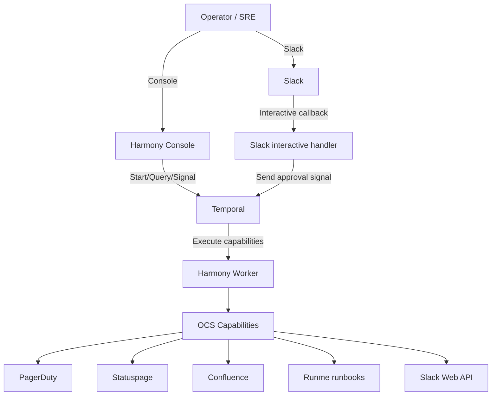

# ADR-002: Incident Management Architecture — Temporal-Centric Orchestration

| Metadata | Value |
| --- | --- |
| ID | ADR-002 |
| Version | 1.0.0 |
| Status | PROPOSED |
| Authors | Platform Engineering |
| Date | 2026-02-01 |
| Context | Temporal-centric incident orchestration |
| Supersedes | — |

---

## 1. Decision Summary

Adopt a **Temporal-centric** architecture for incident management in Harmony: incidents are modeled and executed as durable workflows (Blueprints) that orchestrate capabilities (Slack, PagerDuty, Statuspage, Confluence, Runme runbooks) and enforce policy through consistent context propagation and HITL approval gates.

This decision prioritizes **durability**, **auditability**, and **deterministic execution** over “glue scripts” or ephemeral automation, while keeping operator experience fast via Slack/Console entry points.

---

## 2. Context & Problem Statement

### 2.1 Current State

- Incident response commonly spans multiple systems (Slack, on-call, status comms, documentation, remediation runbooks).
- Ad-hoc scripts and manual checklists are hard to audit, easy to skip under pressure, and difficult to replay or validate.
- Existing Phase 2 foundations already exist in Harmony:
  - Incident fields in `GoldenContext` (`P1`–`P4`) for correlation and policy
  - HITL approval gates via Temporal signals/queries (`approval` signal, `approvalState` query)
  - Slack interactive callback handler for sending approval signals to workflows

### 2.2 Desired State

- A single **incident lifecycle suite** of Blueprints that:
  - Initiate an incident with consistent IDs and context
  - Run remediation actions (including runbooks) with policy gates
  - Close out the incident with final comms and documentation updates
  - Produce post-mortem artifacts and action tracking hooks
- Operator-first entry points (Console + Slack) that do not sacrifice audit trail or determinism.
- Integration patterns that are reusable across incident workflows and other operational automations.

---

## 3. Decision Drivers

| Driver | Weight | Rationale |
| --- | --- | --- |
| Durability & replay | High | Incident workflows must survive restarts and support deterministic history replay. |
| Audit trail | High | Approvals, decisions, and actions must be attributable and reviewable. |
| Determinism | High | Workflows must be safe to evolve and debug; avoid non-deterministic behavior. |
| Operator UX | Medium | On-call needs fast, low-friction controls (Slack/Console). |
| Integration reuse | Medium | PagerDuty/Statuspage/Confluence integrations should be capabilities reused by many workflows. |

---

## 4. Proposed Solution

### 4.1 Architecture overview

### 4.2 Blueprint suite (incident lifecycle)

We standardize a suite of Blueprints (workflow IDs are stable correlation keys):

- `incident.initiate`: establish incident ID + severity + channel, create external incident records
- `incident.remediate`: execute remediation steps and runbooks with HITL gates for sensitive actions
- `incident.close-out`: close comms, resolve external incidents, finalize timelines
- `incident.post-mortem`: generate and publish post-mortem doc, capture action items

### 4.3 Context propagation contract

Workflows carry incident correlation keys through `GoldenContext`, passed via workflow memo (`golden.context`) and then forwarded to capability executions.

Canonical incident fields:

- See `packages/core/src/context/golden-context.ts` and `packages/core/src/context/incident-context.ts`

Severity policy:

- See `docs/incidents/severity-definitions.md`

### 4.4 HITL approval gates

For any operation that is destructive, irreversible, or changes production posture:

- Use `BaseBlueprint.waitForApproval(...)` to:
  - emit a Slack approval request (optional)
  - expose queryable state (`approvalState`) for Console UX
  - proceed only on valid approval signal payloads

Contract and templates:

- `packages/core/src/wcs/approval-signal.ts`
- `packages/core/src/wcs/base-blueprint.ts` (implementation of `waitForApproval`)

### 4.5 Runbook execution

Operational procedures are encoded as Markdown runbooks and executed by the Runme runner capability:

- `golden.operations.runme-runner` (`packages/capabilities/src/operations/runme-runner.capability.ts`)
- Sample runbooks live in `runbooks/`

This enables:

- repeatable, reviewable remediation steps
- easy extraction of runbook output for incident timeline/audit

### 4.6 Integration patterns (PagerDuty, Statuspage, Confluence)

Integrations are implemented as **capabilities** (not workflow-specific code) so:

- workflows remain orchestration-only
- security posture and scopes are declared in capability metadata
- contract tests validate schemas and discovery metadata

Each incident blueprint composes these capabilities to:

- create/update/resolve PagerDuty incidents
- create/update Statuspage incidents and components
- publish Confluence pages (runbooks, incident timeline, post-mortem)

---

## 5. Alternatives Considered

### 5.1 Standalone incident automation service (non-Temporal)

| Pros | Cons |
| --- | --- |
| Simpler deployment surface | Loses Temporal durability/replay primitives |
| Custom UX possible | Rebuilds state machine, retries, timeouts, and audit patterns |

**Decision:** Rejected. Temporal provides durable orchestration primitives that are expensive and risky to re-implement.

### 5.2 “Glue scripts” and manual runbooks only

| Pros | Cons |
| --- | --- |
| Fast to start | Poor auditability and repeatability |
| No orchestration overhead | Hard to enforce approvals/policy consistently |

**Decision:** Rejected. Incidents are precisely the environment where guardrails and durable history matter most.

---

## 6. Consequences

### 6.1 Positive

- **Durability:** workflows and their state survive process crashes and redeploys.
- **Audit trail:** approvals and remediation actions are persisted in workflow history.
- **Policy enforcement:** severity-driven behavior and HITL gates can be applied uniformly.
- **Reuse:** integrations become capabilities usable by many workflows beyond incident management.

### 6.2 Negative

- **Higher upfront design cost:** workflows require deliberate contracts (signals/queries, context fields).
- **Operational dependency:** incident orchestration depends on Temporal availability (mitigate with HA and clear runbook fallback).
- **Integration complexity:** capability quality gates and allowlists must be maintained (mitigate via deterministic catalogs and tests).

### 6.3 Risks

| Risk | Likelihood | Impact | Mitigation |
| --- | --- | --- | --- |
| Workflow contract drift (signals/queries) breaks UI/Slack | Medium | High | Versioning discipline; stable `action_id` and query names; contract tests. |
| Slack callback forgery | Low | High | Enforce signature verification middleware and secret management. |
| Over-gating slows response | Medium | Medium | Severity-driven defaults; allow immediate containment actions for P1. |

---

## 7. Verification

### 7.1 Unit Tests

- Approval gates: `packages/core/src/wcs/approval-signal.test.ts`
- Incident context helpers: `packages/core/src/context/incident-context.test.ts`

### 7.2 Acceptance Criteria

- [ ] Incident workflows can carry correlation IDs through `GoldenContext` and into capability execution.
- [ ] Approval gates expose queryable state and accept valid approval signals.
- [ ] Slack interactive callbacks can approve/reject a waiting workflow within SLA.
- [ ] Runbooks are executable via the Runme runner capability.

---

## 8. References

- `docs/incidents/severity-definitions.md`
- `runbooks/`
- `packages/core/src/context/golden-context.ts`
- `packages/core/src/context/incident-context.ts`
- `packages/core/src/wcs/approval-signal.ts`
- `packages/core/src/wcs/base-blueprint.ts`
- `packages/apps/console/server/integrations/http/slack-interactive-handler.ts`
- `docs/integrations/openapi-specs.md` (integration spec pointers; see ADR-003+ for per-provider decisions)

---

## 9. Changelog

### 1.0.0 (2026-02-01)

- Initial ADR for Temporal-centric incident management architecture

