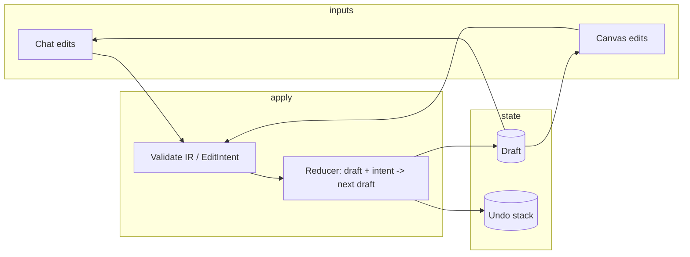

# ADR-003: Workbench State Model and Sync/Undo Semantics

| Metadata | Value |
| --- | --- |
| ID | ADR-003 |
| Version | 1.0.0 |
| Status | PROPOSED |
| Authors | Platform Engineering |
| Date | 2026-02-02 |
| Context | Chat-canvas hybrid workbench; single source of truth and deterministic edit application |
| Supersedes | — |

---

## 1. Decision Summary

Adopt a **single source of truth** for the workbench: the draft is represented as a **BlueprintDraft** (IR). All edits—whether from chat (agent-produced) or from direct canvas interaction—are applied via a **reducer-style event model** that produces the next draft. **Undo/redo** is implemented as a bounded history stack of draft snapshots (or inverse operations). **Conflict resolution** is last-write-wins per draft with optional validation gates; AI-produced diffs stay within deterministic boundaries (valid EditIntents or full draft replace).

---

## 2. Context & Problem Statement

### 2.1 Current State

- Workbench has chat (agent) and canvas (user) as two entry points for editing a workflow.
- Without a defined state model, chat and canvas could diverge; undo/redo and conflict handling are underspecified.
- Agent may produce full BlueprintDraft or edit intents; canvas may produce direct node/edge mutations.

### 2.2 Desired State

- One canonical draft state; chat and canvas are views of the same IR.
- Edits from either source are applied in a well-defined order with clear undo semantics.
- Determinism: AI output is validated (schema + referential integrity) before apply; invalid output does not corrupt state.

---

## 3. Decision Drivers

| Driver | Weight | Rationale |
| --- | --- | --- |
| Single source of truth | High | Prevents chat/canvas divergence and simplifies testing and reasoning. |
| Determinism | High | AI-produced edits must be valid and replayable; no undefined behavior. |
| Undo/redo | Medium | Users expect to revert mistakes (especially after chat-driven edits). |
| Conflict resolution | Medium | Define behavior when multiple edits could conflict (e.g. same node). |

---

## 4. Proposed Solution

### 4.1 Single Source of Truth

- **Representation:** The workbench holds one **draft** of type `BlueprintDraft` (see `spec/workbench-ir.schema.json` and `packages/apps/console/client/src/features/workbench/types.ts`).
- **Ownership:** The draft is the only mutable workflow state in the workbench session. Chat and canvas both read from and write to this draft via a single apply path (see 4.2).
- **Persistence:** Draft is session-scoped unless the user explicitly saves (e.g. as template or blueprint). Build vs Run mode and persistence rules are defined in `product-management/workbench-ux.spec.md`.

### 4.2 Event / Reducer Model

- **Chat-driven edits:** Agent returns a full `BlueprintDraft` (replace) or a sequence of `EditIntent`s. Each intent is validated (schema + referential integrity per `docs/workbench-ir-validation.md`), then applied in order. The reducer is pure: `(draft, intent) => nextDraft`.
- **Canvas-driven edits:** User actions (add node, delete edge, rename, etc.) are translated into the same IR semantics (e.g. equivalent EditIntent or direct draft mutation). They go through the same apply path so that one history stack can serve both.
- **Ordering:** Edits are applied sequentially. No concurrent edits from the same user session; if we later support real-time collaboration, this ADR does not prescribe the merge strategy (could be OT/CRDT in a future ADR).

### 4.3 Undo / Redo and Conflict Resolution

- **Undo:** Maintain a bounded stack of draft snapshots (e.g. last N states). "Undo" pops the stack and sets the draft to the previous snapshot. Optional: store inverse operations instead of full snapshots to save memory.
- **Redo:** If we use snapshots, a "redo" stack holds states after undo; redo pops that stack and sets the draft. If we use inverse ops, redo reapplies the last undone op.
- **Conflict resolution:** For a single-user session, conflicts are avoided by serializing edits. If an edit is invalid (e.g. intent references removed node), the edit is rejected and the draft unchanged; user sees an error (see workbench-ir-validation.md). No automatic merge of conflicting concurrent edits in MVP.

### 4.4 Determinism Boundaries for AI-Produced Diffs

- **Validation gate:** Before applying any agent output:
  - Full draft replace: validate against `BlueprintDraft` schema and referential integrity (edges reference existing nodes).
  - Edit intents: validate each intent against `EditIntent` schema and current draft (node ids exist, no duplicate ids on add, etc.).
- **Reject invalid output:** If validation fails, do not update the draft; surface a user-facing error and optionally log the raw output for debugging.
- **No non-determinism in apply:** The reducer must be pure and synchronous for draft updates. Async work (e.g. tool calls) happens outside the draft update path.

---

## 5. Alternatives Considered

### 5.1 Two separate state trees (chat vs canvas)

| Pros | Cons |
| --- | --- |
| Could optimize per view | Divergence, complex sync, harder to test |

**Decision:** Rejected; single source of truth reduces bugs and keeps UX predictable.

### 5.2 No undo stack (always replace draft from server)

| Pros | Cons |
| --- | --- |
| Simpler implementation | Poor UX; user cannot revert mistaken chat edits |

**Decision:** Rejected; undo/redo is expected in editors.

---

## 6. Consequences

### 6.1 Positive

- Chat and canvas stay in sync; one testable apply path.
- Clear validation and error surfacing for invalid agent output.
- Undo/redo gives users confidence to try chat-driven edits.

### 6.2 Negative

- Reducer and history must be implemented and tested; some refactor of existing canvas logic may be needed to route through the reducer.

### 6.3 Risks

| Risk | Likelihood | Impact | Mitigation |
| --- | --- | --- | --- |
| Performance with large undo stack | Low | Medium | Bound stack size (e.g. 50); or store inverse ops. |
| Canvas and chat producing different shapes for same intent | Medium | Low | Standardize on EditIntent/draft mutations; document mapping from UI actions to intents. |

---

## 7. Verification

### 7.1 Unit Tests

- Reducer: for each EditIntent type, given a draft and intent, output matches expected next draft.
- Validation: invalid intents (missing node, duplicate id) are rejected and draft unchanged.

### 7.2 Acceptance Criteria

- [ ] Single draft state; chat and canvas show the same nodes/edges after any edit.
- [ ] Undo reverts last edit (chat or canvas); redo restores it.
- [ ] Invalid agent output does not change the draft; user sees an error message.

---

## 8. References

- [Workbench UX Spec Pack](../../product-management/workbench-ux.spec.md)
- [Chat→IR Contract](../../spec/workbench-ir.schema.json)
- [Workbench IR Validation](../workbench-ir-validation.md)
- [Workbench UX Plan](.cursor/plans/workbench_ux_implementation_9d4a3268.plan.md) (Phase 3.7, 4.x)
