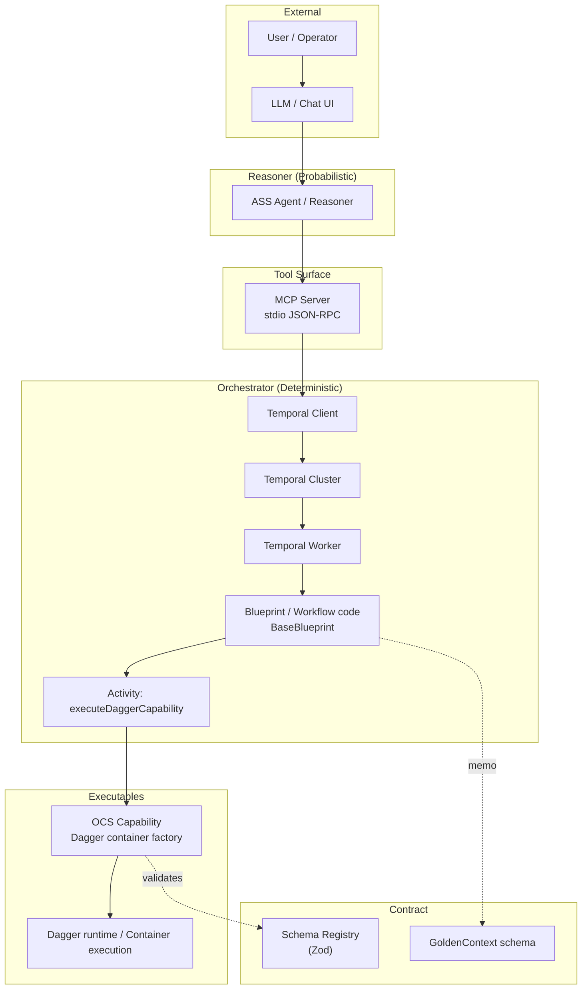
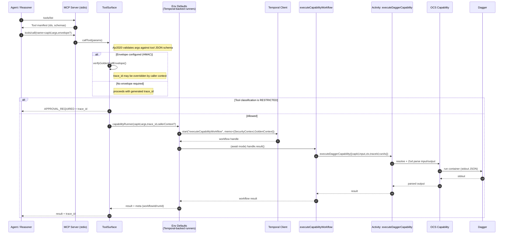
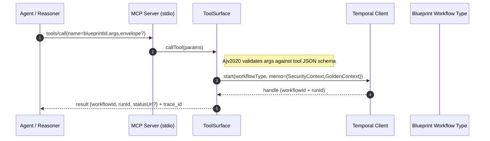
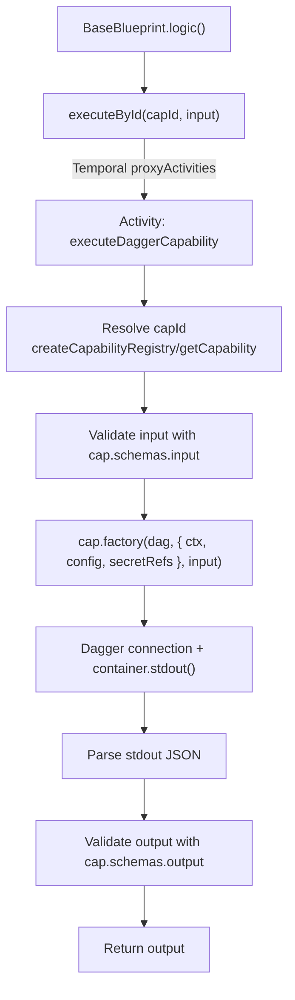
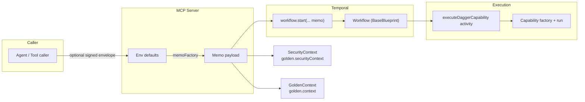
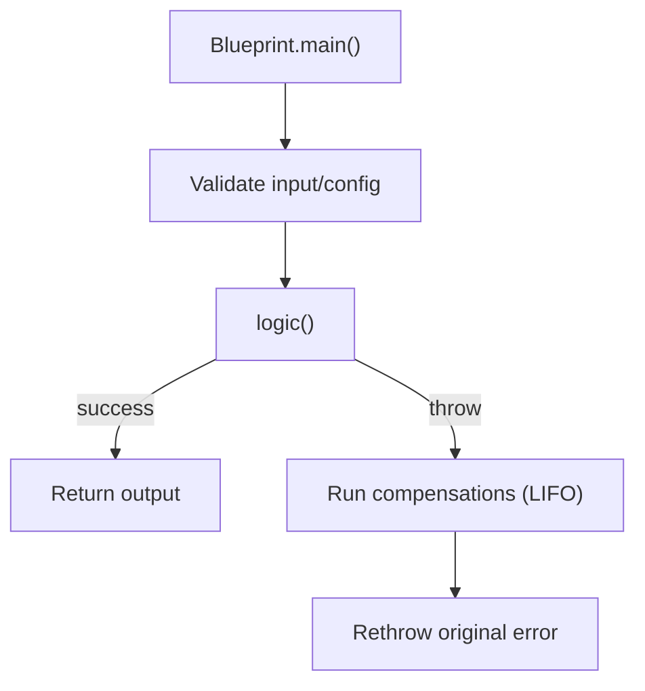

## Harmony (Golden Path) — Application Architecture & Flows

This repository is a **Self-Assembling Platform** built around a simple mental model (the **Runtime Tetrad**) and a strict separation of concerns enforced by an Nx + pnpm monorepo.

The goal of this document is to explain **why** the architecture is shaped the way it is, and **how** the major runtime flows execute end-to-end.

---

## Overview (The Runtime Tetrad)

Harmony treats automation as four cooperating runtime concerns:

- **Orchestrator**: deterministic workflow execution (Temporal)
- **Reasoner**: probabilistic planning/decisioning (agents / reasoners)
- **Contract**: shared schemas and type contracts (Zod schema registry)
- **Executable**: containerized “do work” primitives (capabilities and blueprints)

At runtime, “a thing happens” by turning an **intent** into a **tool call**, which becomes either:
- **a capability execution** (one unit of work), or
- **a blueprint execution** (a workflow composed of capability executions).

---

## Monorepo layout (where things live)

The repository is organized into layered packages:

- **`packages/core`**: shared runtime primitives and base classes
  - `packages/core/src/ocs/*`: capability (OCS) interfaces
  - `packages/core/src/wcs/*`: workflow composition (WCS) base classes for Temporal
  - `packages/core/src/context/*`: Golden Context models and validation
- **`packages/schema-registry`**: centralized Zod exports / schema reuse
- **`packages/capabilities`**: OCS “bricks” (Connectors / Transformers / Commanders)
- **`packages/blueprints`**: WCS Temporal workflows and workers
- **`packages/agents`**: ASS agents/reasoners (LangGraph-style)
- **`packages/tools/mcp-server`**: an MCP server that exposes tools and routes execution

Normative standards are mirrored as Cursor skills under **`.cursor/skills/`** (see `standards/README.md`).

---

## High-level architecture (containers and boundaries)

The primary runtime integration surface is **MCP over stdio**; the primary execution substrate is **Temporal**.

---

## Key concepts (the nouns you’ll see everywhere)

### Capability (OCS)

A **Capability** is an OCS-compliant unit of work defined by:
- metadata (id/version/name/maintainer)
- schemas (input/output/config/secrets)
- security + operations (classification, retry, idempotency, network allowlist, etc.)
- a **pure factory** that returns a Dagger container definition

Source: `packages/core/src/ocs/capability.ts`

### Blueprint / Workflow (WCS)

A **Blueprint** is a deterministic Temporal workflow. The base implementation:
- validates input/config via Zod
- enforces “safe deterministic” workflow utilities
- executes capabilities through a single shared activity (`executeDaggerCapability`)
- runs **Saga compensations** in LIFO order on failure

Source: `packages/core/src/wcs/base-blueprint.ts`, `packages/core/src/wcs/saga-manager.ts`

### GoldenContext + SecurityContext

These two contexts are injected into workflows via Temporal **memo**:
- **SecurityContext**: identity and RBAC (`initiatorId`, `roles`, `tokenRef`, optional `traceId`)
  - Source: `packages/core/src/wcs/security-context.ts`
- **GoldenContext**: request correlation and policy context (`app_id`, `environment`, `initiator_id`, `trace_id`, optional cost/data classification)
  - Source: `packages/core/src/context/golden-context.ts`

The memo keys are:
- `golden.securityContext`
- `golden.context`

Source: `packages/core/src/wcs/base-blueprint.ts`

---

## Flow 1 — MCP tool call (Capability execution)

This is the “most common” flow: an agent chooses a capability tool and calls it.

### What “await vs start” means

The MCP server can run capability tools in one of two modes:
- **await**: wait for Temporal workflow completion and return the output
- **start**: start the workflow and immediately return the workflow handle metadata

Source: `packages/tools/mcp-server/src/mcp/temporal-default-runners.ts`, env `MCP_CAPABILITY_BEHAVIOR`

---

## Flow 2 — MCP tool call (Blueprint execution)

Blueprint tools start a specific workflow type based on the blueprint registry entry (id → workflowType).

Source: `packages/tools/mcp-server/src/mcp/temporal-default-runners.ts`

---

## Flow 3 — Workflow → Activity → Capability (Dagger) execution

Inside a workflow, capability execution is done through the shared activity:
- `BaseBlueprint.executeById()` proxies `executeDaggerCapability`
- the activity resolves the capability from a registry and runs its Dagger container

Sources:
- Workflow side: `packages/core/src/wcs/base-blueprint.ts`
- Activity side: `packages/blueprints/src/worker/execute-dagger-capability.ts`

---

## Context propagation (how trace + identity flows)

Golden Path uses Temporal memo to propagate identity + correlation context consistently.

Source: `packages/tools/mcp-server/src/mcp/stdio-server.ts` (memoFactory), `packages/core/src/wcs/base-blueprint.ts` (memo keys/getters)

---

## Guardrails and safety checks

### Input validation

- Tool inputs are validated at the MCP surface using **Ajv 2020-12** JSON Schema validation.
  - Source: `packages/tools/mcp-server/src/mcp/tool-surface.ts`

### RESTRICTED execution preflight

- If a tool is marked `RESTRICTED`, the MCP surface returns `APPROVAL_REQUIRED` and does not execute.
  - Source: `packages/tools/mcp-server/src/mcp/tool-surface.ts`

### Caller context spoofing protection (optional)

- A signed envelope (`HMAC-SHA256`) can be required to prevent spoofed caller identity/roles.
  - Source: `packages/tools/mcp-server/src/mcp/call-envelope.ts`
  - Env: `MCP_ENVELOPE_HMAC_SECRET`, `MCP_REQUIRE_ENVELOPE`

---

## Failure handling (Saga / compensation)

Blueprints can register compensations; on error the framework runs compensations in **LIFO** order and then rethrows.

Source: `packages/core/src/wcs/base-blueprint.ts`, `packages/core/src/wcs/saga-manager.ts`

---

## Local runtime notes (common env knobs)

For the MCP stdio server’s Temporal-backed defaults, the key env vars are:

- **Temporal**: `TEMPORAL_TASK_QUEUE`, `TEMPORAL_ADDRESS`, `TEMPORAL_NAMESPACE`, `TEMPORAL_UI_URL`
- **MCP identity defaults**: `MCP_INITIATOR_ID`, `MCP_ROLES`, `MCP_TOKEN_REF`, `MCP_APP_ID`, `MCP_ENVIRONMENT`, `MCP_COST_CENTER`, `MCP_DATA_CLASSIFICATION`
- **Envelope**: `MCP_ENVELOPE_HMAC_SECRET`, `MCP_REQUIRE_ENVELOPE`
- **Capability result behavior**: `MCP_CAPABILITY_BEHAVIOR` (`await` | `start`)

Source: `packages/tools/mcp-server/src/mcp/stdio-server.ts`

For actual Dagger execution:
- Set **`ENABLE_DAGGER_E2E=1`**, otherwise capability execution throws `DAGGER_E2E_DISABLED`.

Source: `packages/blueprints/src/worker/execute-dagger-capability.ts`

---

## Troubleshooting (high-signal failures)

- **`INPUT_VALIDATION_FAILED`**: tool args do not match the manifest JSON schema (Ajv errors included).
- **`APPROVAL_REQUIRED`**: tool is `RESTRICTED` and requires explicit approval/HITL gating.
- **`UNAUTHORIZED`**: envelope required or signature invalid.
- **`NOT_CONFIGURED`**: MCP tool surface has no runner configured for that tool type.
- **`GoldenContext not set in workflow memo`**: platform started workflow without `golden.context` memo; capability execution is blocked.
- **`SecurityContext not set in workflow memo`**: platform started workflow without `golden.securityContext` memo; workflows treat this as fatal.
- **`DAGGER_E2E_DISABLED`**: worker refuses to execute containers unless explicitly enabled.

