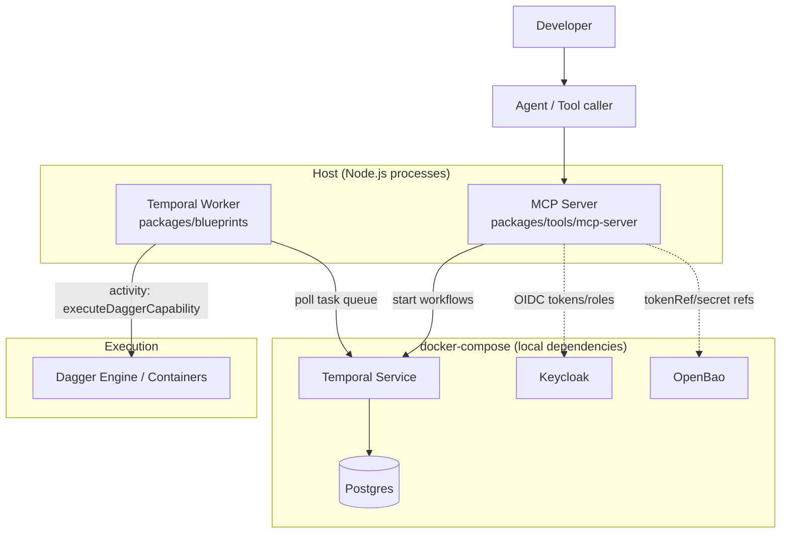

## Deployment & Runtime Topology

This document describes how Harmony is intended to run **locally** (via `docker-compose.yml`) and what the **target topology** looks like when deployed as a platform.

Harmony’s “happy path” runtime is:

- **Reasoner** (agent / tool caller) calls **MCP tools**
- MCP routes execution to **Temporal workflows**
- Temporal workers execute **activities** that run **capabilities** (Dagger containers)
- **Context** (identity + trace) is propagated via Temporal memo as `SecurityContext` and `GoldenContext`

---

## Local development topology

Local dev uses containers for core dependencies and typically runs Harmony processes on the host (Node.js):

- `postgres`: backing store for Temporal
- `temporal`: Temporal service (`7233`) + web (`8080` in compose; UI often exposed separately)
- `keycloak`: identity provider (`8081` host → `8080` container)
- `openbao`: secret store (`8200`)

Source: `docker-compose.yml`



---

## Target (production) topology

In production, the same logical components exist, but responsibilities are typically separated:

- **MCP server** runs as a service (or sidecar) close to the agent runtime
- **Temporal cluster** runs as managed infrastructure
- **Workers** run as scalable compute (Kubernetes deployment, autoscaled by task queue depth)
- **Keycloak (or another OIDC IdP)** supplies identity/roles
- **OpenBao (or ESO-backed secrets)** supplies secret references and late-bound credentials
- **Dagger execution** runs in an isolated environment with explicit egress controls

```mermaid
flowchart TB
  subgraph Reasoning["Reasoning"]
    Agent[Agent / Reasoner runtime]
  end

  subgraph Tooling["Tooling"]
    MCP[MCP Server]
  end

  subgraph Orchestration["Orchestration"]
    Temporal[Temporal Cluster]
    TQ[Task Queue]
  end

  subgraph Compute["Compute"]
    Worker[Temporal Workers]
    Dagger[Dagger Execution Environment]
  end

  subgraph Identity["Identity and Secrets"]
    IdP[OIDC IdP (Keycloak)]
    Secrets[Secrets Store (OpenBao/ESO)]
  end

  Agent --> MCP --> Temporal
  Temporal --> TQ --> Worker
  Worker --> Dagger
  MCP --> IdP
  Worker --> Secrets
```

---

## Configuration (high-signal knobs)

### Temporal connectivity (MCP server)

The MCP server can create Temporal-backed default runners from env vars:

- **`TEMPORAL_TASK_QUEUE`**: task queue to start workflows on (default: `golden-tools`)
- **`TEMPORAL_ADDRESS`**: Temporal frontend address (default: `localhost:7233`)
- **`TEMPORAL_NAMESPACE`**: Temporal namespace (default: `default`)
- **`TEMPORAL_UI_URL`**: used to generate status URLs (default: `http://localhost:8233`)

Source: `packages/tools/mcp-server/src/mcp/stdio-server.ts`

### Identity defaults (when no signed envelope is provided)

- **`MCP_INITIATOR_ID`**: default initiator id (default: `mcp:anonymous`)
- **`MCP_ROLES`**: comma-separated roles
- **`MCP_TOKEN_REF`**: secret reference for the token (string, default empty)
- **`MCP_APP_ID`**, **`MCP_ENVIRONMENT`**, **`MCP_COST_CENTER`**, **`MCP_DATA_CLASSIFICATION`**

Source: `packages/tools/mcp-server/src/mcp/stdio-server.ts`

### Signed call envelope (spoofing protection)

- **`MCP_ENVELOPE_HMAC_SECRET`**: enables HMAC envelope verification
- **`MCP_REQUIRE_ENVELOPE`**: if `true`, calls without a valid envelope are rejected

Source: `packages/tools/mcp-server/src/mcp/stdio-server.ts`, `packages/tools/mcp-server/src/mcp/call-envelope.ts`

### Capability execution mode

- **`MCP_CAPABILITY_BEHAVIOR`**: `await` (return output) or `start` (return workflow handle)

Source: `packages/tools/mcp-server/src/mcp/stdio-server.ts`, `packages/tools/mcp-server/src/mcp/temporal-default-runners.ts`

### Dagger execution (worker)

- **`ENABLE_DAGGER_E2E=1`** is required for the worker activity to actually execute containers.

Source: `packages/blueprints/src/worker/execute-dagger-capability.ts`

### Dagger guardrails (ISS-001)

The Dagger runtime namespace must enforce ISS-001 guardrails for isolation and egress control:

- Resource quotas: `k8s/dagger/resourcequota.yaml`
- Default deny egress: `k8s/dagger/networkpolicy-deny-all.yaml`
- FQDN allowlist (Cilium): `k8s/dagger/cilium-networkpolicy-allowlist.yaml`
- Ephemeral volume enforcement: `k8s/dagger/validating-admission-policy.yaml`
