# Incident Lifecycle Architecture

## Overview

The Incident Lifecycle Blueprint Suite provides end-to-end incident management orchestrated through Temporal workflows. It automates incident initiation, remediation, close-out, and post-mortem generation while maintaining human oversight through HITL approval gates.

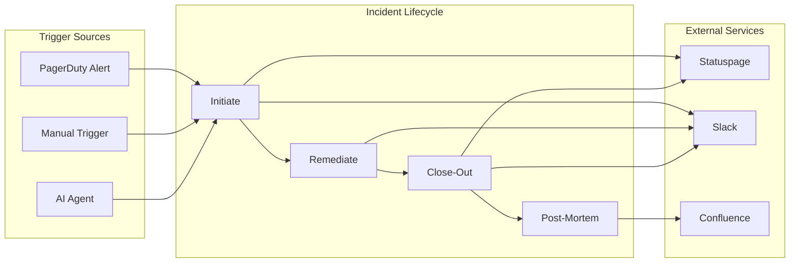

---

## Key Concepts

### Blueprints

Blueprints are Temporal workflows that orchestrate capabilities. Each incident lifecycle phase is a separate blueprint:

| Blueprint | Purpose | HITL Required |
|-----------|---------|---------------|
| `incident.initiate` | Start incident response | Severity-dependent |
| `incident.remediate` | Execute remediation actions | Yes |
| `incident.close-out` | Close incident and communications | Severity-dependent |
| `incident.post-mortem` | Generate post-incident review | Yes |

### Capabilities

Capabilities are OCS-compliant modules that perform specific actions:

| Capability | Type | Purpose |
|------------|------|---------|
| `golden.connectors.statuspage` | Connector | Manage Statuspage incidents |
| `golden.connectors.confluence` | Connector | Create Confluence pages |
| `golden.connectors.pagerduty` | Connector | Interact with PagerDuty |
| `golden.integrations.slack-interactive` | Integration | Slack messaging and approvals |
| `golden.operations.runme-runner` | Commander | Execute runbooks |
| `golden.transformers.incident-timeline` | Transformer | Record/query timeline |

### GoldenContext

Every workflow receives a `GoldenContext` with incident-specific fields:

```typescript
interface GoldenContext {
  trace_id: string;
  initiator_id: string;
  cost_center: string;
  
  // Incident-specific
  incident_id?: string;
  incident_severity?: 'P1' | 'P2' | 'P3' | 'P4';
  incident_title?: string;
  incident_channel?: string;
  pagerduty_incident_id?: string;
  statuspage_incident_id?: string;
  impacted_services?: string[];
}
```

---

## Architecture

### System Context

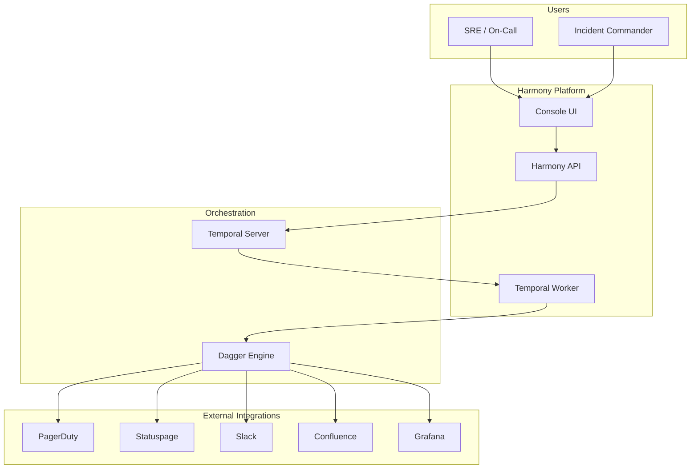

### Component Architecture

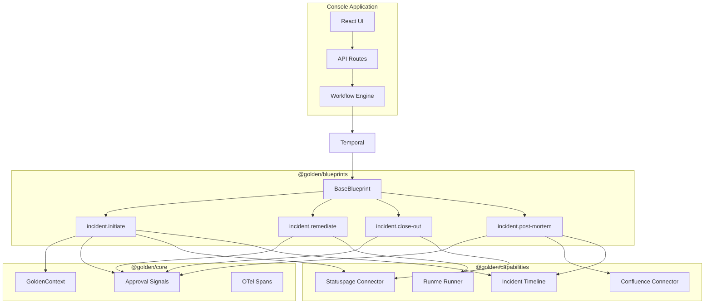

---

## How It Works

### Incident Initiation Flow

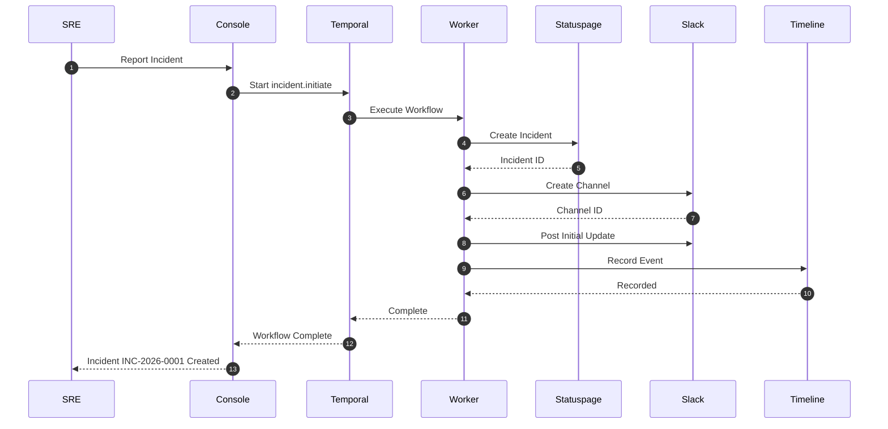

### Remediation with HITL Approval

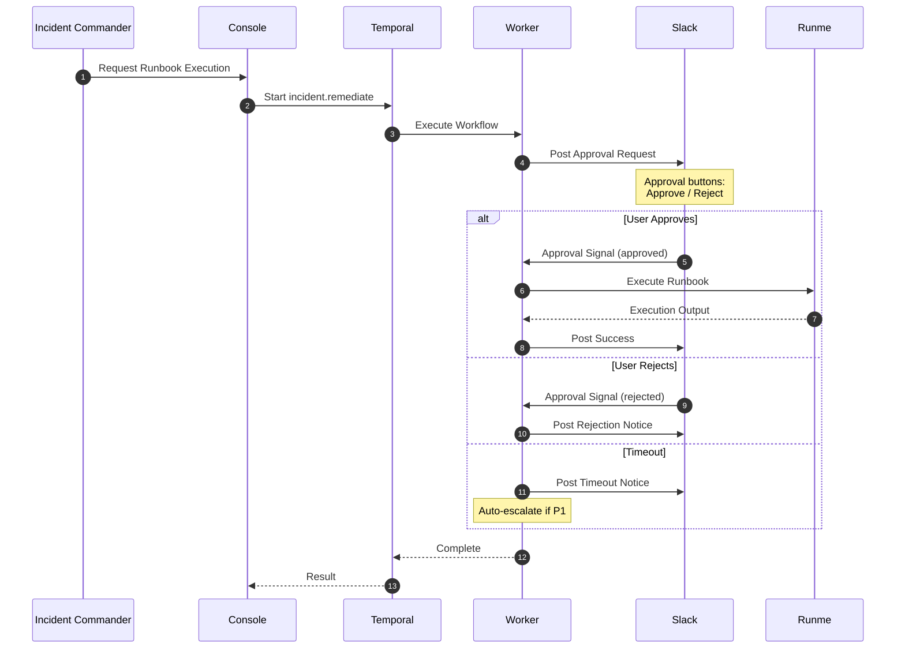

### Close-Out Flow

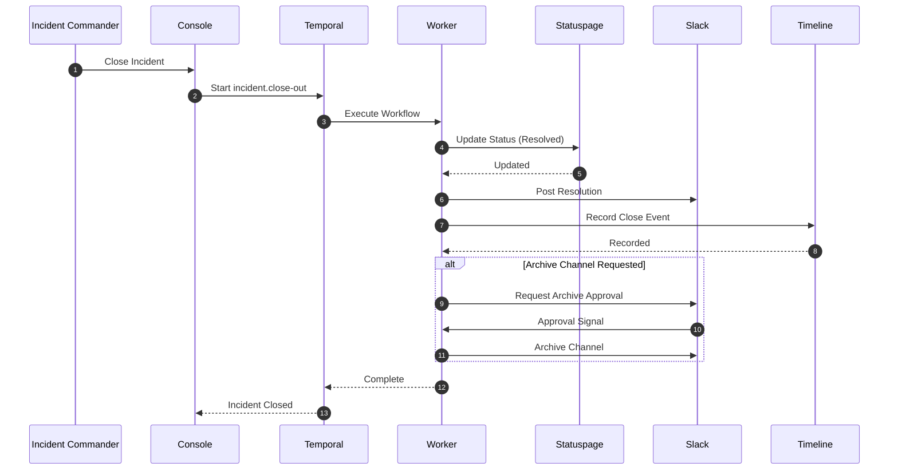

### Post-Mortem Generation

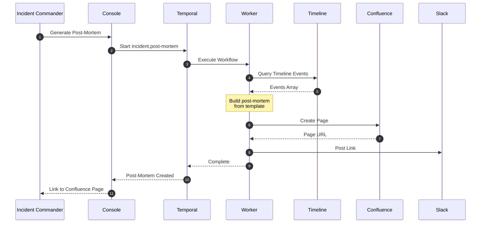

---

## State Machine

### Incident Lifecycle States

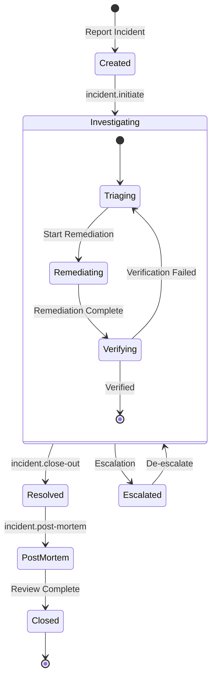

### Approval States

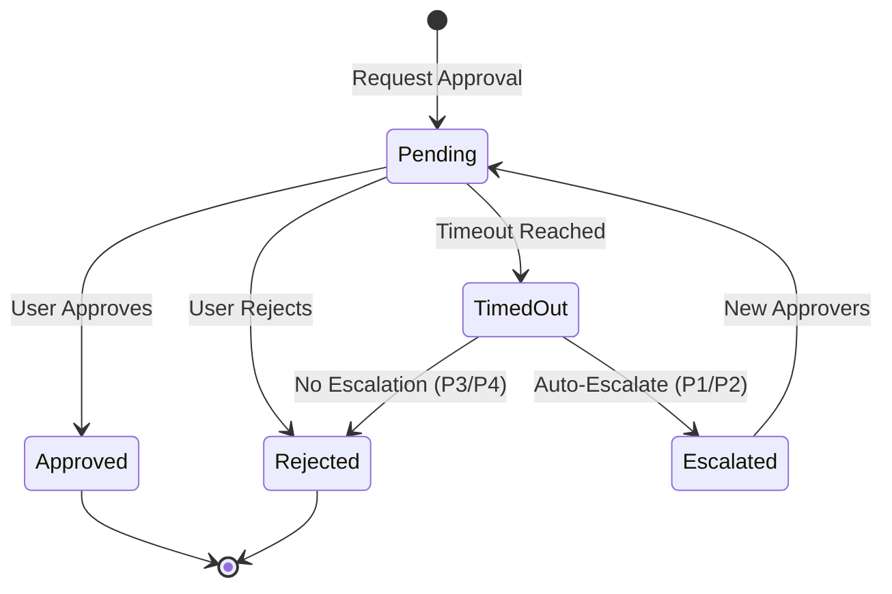

---

## Data Model

### Incident Context

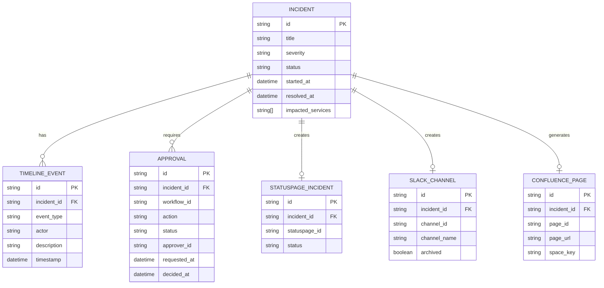

---

## RBAC Matrix

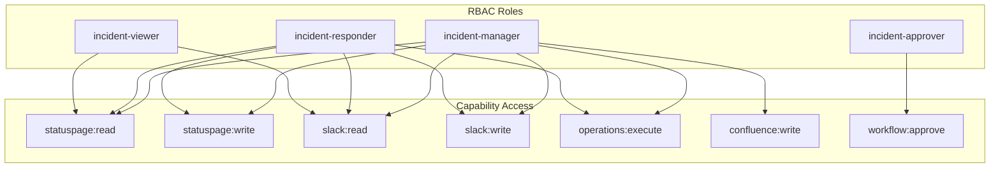

---

## Deployment

### Kubernetes Architecture

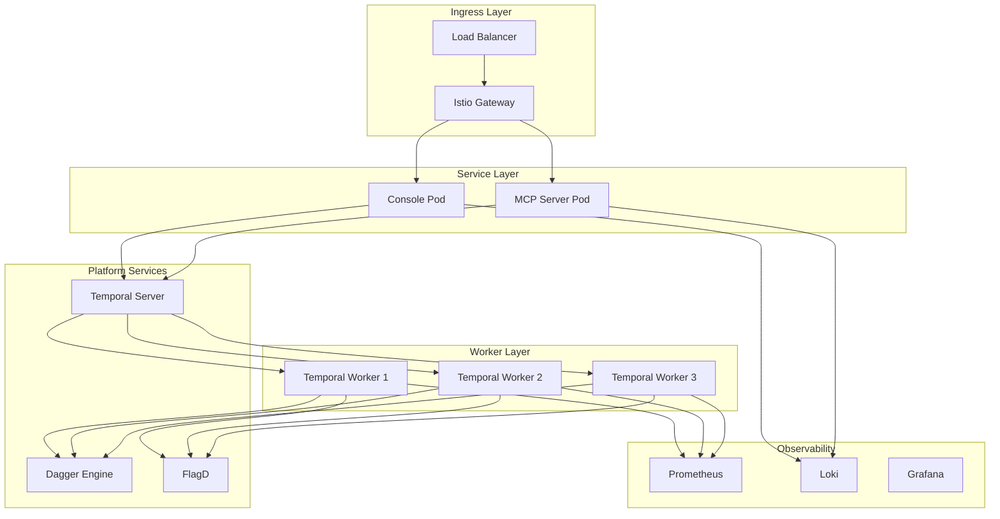

---

## Configuration

### Feature Flags

| Flag | Default | Purpose |
|------|---------|---------|
| `cap-golden.connectors.statuspage-enabled` | true | Enable Statuspage integration |
| `cap-golden.connectors.confluence-enabled` | true | Enable Confluence integration |
| `cap-golden.operations.runme-runner-enabled` | true | Enable runbook execution |
| `incident.auto-escalate-p1` | true | Auto-escalate P1 on timeout |

### Environment Variables

```bash
# External Services
STATUSPAGE_API_KEY=secret
CONFLUENCE_API_TOKEN=secret
PAGERDUTY_API_KEY=secret
SLACK_BOT_TOKEN=secret
SLACK_SIGNING_SECRET=secret

# Temporal
TEMPORAL_ADDRESS=temporal:7233
TEMPORAL_NAMESPACE=harmony

# Feature Flags
FLAGD_HOST=flagd
FLAGD_PORT=8013
```

---

## Troubleshooting

### Common Issues

| Symptom | Cause | Solution |
|---------|-------|----------|
| Approval timeout | No approvers available | Check on-call schedule |
| Statuspage update fails | Invalid API key | Rotate STATUSPAGE_API_KEY |
| Slack channel not created | Missing permissions | Verify Slack app scopes |
| Runbook execution hangs | Container timeout | Increase activity timeout |
| Post-mortem empty | No timeline events | Verify Timeline capability |

### Debug Workflow

```bash
# Get workflow history
tctl workflow show -w incident.initiate-INC-2026-0001

# Query workflow state
tctl workflow query -w incident.initiate-INC-2026-0001 -qt approvalState

# Signal approval manually
tctl workflow signal -w incident.initiate-INC-2026-0001 -n approval \
  --input '{"decision":"approved","approverId":"admin"}'
```

---

## Related Documentation

- [Severity Definitions](/docs/incidents/severity-definitions.md)
- [RBAC Model](/docs/security/incident-lifecycle-rbac.md)
- [Threat Model](/docs/security/incident-lifecycle-threat-model.md)
- [ADR-002: Incident Management Architecture](/docs/adr/ADR-002-incident-management.md)
- [Runbooks](/runbooks/)
