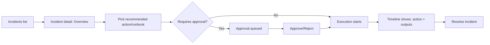
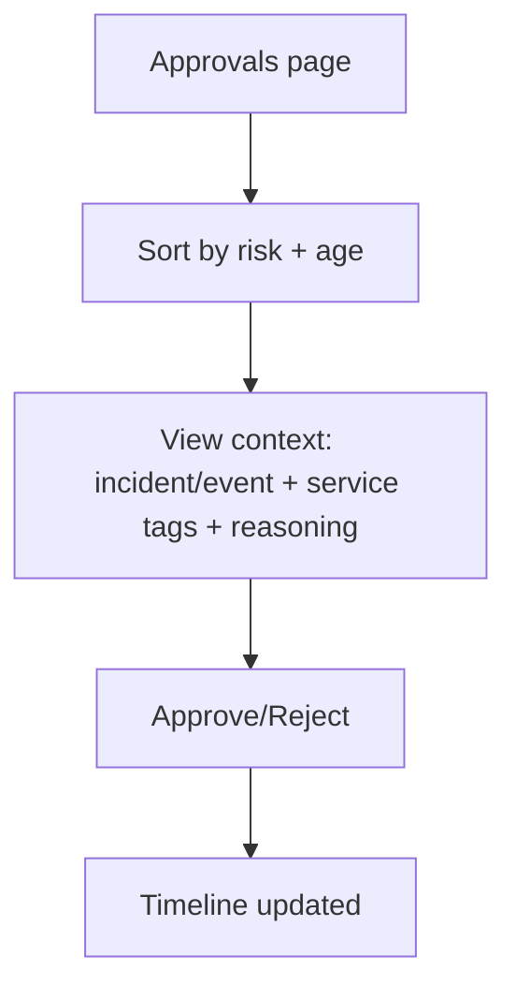

## Overview
This document captures the UX decisions for Phase 5 of the Incident Lifecycle effort: **incident management views**, **approval queue**, **runbook execution**, and **timeline/audit**.

Goals:
- **Fast triage**: get from “something’s wrong” → “what is impacted” → “what to do next” in <60 seconds.
- **Safe action**: destructive actions are visibly gated, with clear context and traceability.
- **Low context switching**: keep incident workflow context, approvals, runbooks, and audit history in one place.

Non-goals (Phase 5):
- Replace Temporal UI for deep workflow history inspection.
- Implement RBAC policy authoring or Slack approver role mapping.

## Primary Users & Jobs-to-be-Done
- **SRE / on-call**: understand impact, execute remediations, request/approve gates, and produce a defensible audit trail.
- **Platform lead**: review incident actions and approvals after the fact.

## IA (Information Architecture)
Top-level navigation additions:
- **Incidents**: list + detail page
- **Approvals**: queue view (cross-incident), optimized for “approve/reject quickly with enough context”
- **Runbooks**: catalog + execution entry points

Within an incident detail:
- **Overview**: current state, key metadata, recommended actions
- **Approvals**: approvals relevant to the incident
- **Runbooks**: runbooks relevant to the incident
- **Timeline**: unified audit feed (signals/events + actions/executions + approvals)

## Key Flows

### Triage → Remediate → Audit (happy path)

### Approvals queue (cross-incident)

## UX Principles (applied)
- **Progressive disclosure**: show just enough context by default; provide detail drawers for “why/what changed”.
- **Safety defaults**: approvals are explicit; risky actions are visually distinct and require reasoning.
- **Consistency**: reuse existing console patterns (Cards, Tabs, Badges, EmptyState).
- **Traceability**: every action has “who/when/why/what target” rendered in UI.

## Component Notes (implementation constraints)
- The console currently uses `wouter` routing and `shadcn/ui` primitives (Cards, Tabs, Badges, Dialogs).
- The “incident” entity is represented by an `Event` with `contextType: "incident"` in Phase 5.
- Workflow executions and approvals are rendered from the existing Actions subsystem, extended to include optional context (incident/event and service tags).

## Open Questions / Follow-ons (not required for Phase 5)
- Add canonical `incidentId` across event ingestion + workflow inputs (enables stronger linking than service tags).
- Add timeline persistence (queryable audit log per incident) rather than rebuilding from in-memory executions.
*** End Patch***(FREEFORM) to=functions.ApplyPatch code
