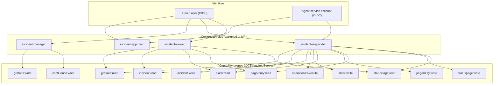

# Incident Lifecycle RBAC Model

**Standard:** UIM-001 (Unified Identity Model)
**Version:** 1.0.0
**Date:** 2026-02-02

---

## 1. Overview

This document defines the Role-Based Access Control (RBAC) model for the Incident Lifecycle Blueprint Suite following UIM-001 patterns.



## 2. Capability Scopes

Each capability defines required scopes that map 1:1 to Keycloak client roles.

### Connector Capabilities

| Capability | Scope | Keycloak Role | Description |
|------------|-------|---------------|-------------|
| `golden.connectors.statuspage` | `statuspage:read` | `golden:statuspage:read` | Read incident status |
| `golden.connectors.statuspage` | `statuspage:write` | `golden:statuspage:write` | Create/update incidents |
| `golden.connectors.confluence` | `confluence:read` | `golden:confluence:read` | Read pages/spaces |
| `golden.connectors.confluence` | `confluence:write` | `golden:confluence:write` | Create/update pages |
| `golden.connectors.pagerduty` | `pagerduty:read` | `golden:pagerduty:read` | Read incidents/alerts |
| `golden.connectors.pagerduty` | `pagerduty:write` | `golden:pagerduty:write` | Create/ack incidents |
| `golden.integrations.slack-interactive` | `slack:read` | `golden:slack:read` | Read messages |
| `golden.integrations.slack-interactive` | `slack:write` | `golden:slack:write` | Post messages |

### Operations Capabilities

| Capability | Scope | Keycloak Role | Description |
|------------|-------|---------------|-------------|
| `golden.operations.runme-runner` | `operations:execute` | `golden:operations:execute` | Execute runbooks |
| `golden.observability.grafana-api` | `grafana:read` | `golden:grafana:read` | Read dashboards |
| `golden.observability.grafana-api` | `grafana:write` | `golden:grafana:write` | Create dashboards |

### Transformer Capabilities

| Capability | Scope | Keycloak Role | Description |
|------------|-------|---------------|-------------|
| `golden.transformers.incident-timeline` | `incident:read` | `golden:incident:read` | Query timeline |
| `golden.transformers.incident-timeline` | `incident:write` | `golden:incident:write` | Record events |

---

## 3. Composite Workflow Roles

Workflows require composite roles containing all capability roles needed for execution.

### incident-responder

**Purpose:** First responder to incidents (P1-P4)

```yaml
role: incident-responder
type: composite
contains:
  - golden:statuspage:read
  - golden:statuspage:write
  - golden:pagerduty:read
  - golden:pagerduty:write
  - golden:slack:read
  - golden:slack:write
  - golden:operations:execute
  - golden:incident:read
  - golden:incident:write
  - golden:grafana:read
```

### incident-manager

**Purpose:** Incident commander with full lifecycle control

```yaml
role: incident-manager
type: composite
contains:
  - incident-responder  # Inherits all responder permissions
  - golden:confluence:read
  - golden:confluence:write
  - golden:grafana:write
```

### incident-approver

**Purpose:** Can approve HITL gates in incident workflows

**Note:** The `workflow:approve` scope below is a **proposed logical permission**. In the current implementation, approval authorization is enforced by:
- workflow-side role checks in `waitForApproval(requiredRoles=...)` against `approverRoles` in the approval signal payload, and/or
- server-side RBAC for Console approval actions.

```yaml
role: incident-approver
type: composite
contains:
  - golden:incident:read
  - workflow:approve  # Proposed: "may approve workflow gates" (see note above)
```

### incident-viewer

**Purpose:** Read-only access to incident data

```yaml
role: incident-viewer
type: composite
contains:
  - golden:statuspage:read
  - golden:pagerduty:read
  - golden:slack:read
  - golden:incident:read
  - golden:grafana:read
```

---

## 4. Agent Service Accounts

### 4.1 Incident Ops Agent

```yaml
service_account: agent-incident-ops
roles:
  - incident-responder
  - incident-approver  # For auto-approval of low-severity items
token_claims:
  - trace_id
  - agent_id
  - cost_center
```

### 4.2 Post-Mortem Agent

```yaml
service_account: agent-incident-postmortem
roles:
  - incident-viewer
  - golden:confluence:write  # Only for post-mortem creation
token_claims:
  - trace_id
  - agent_id
  - cost_center
```

---

## 5. Workflow-Specific RBAC

### incident.initiate

| Action | Required Role | HITL Required |
|--------|---------------|---------------|
| Create Statuspage incident | incident-responder | No (P1-P2) / Yes (P3-P4) |
| Create Slack channel | incident-responder | No |
| Notify PagerDuty | incident-responder | No |

### incident.remediate

| Action | Required Role | HITL Required |
|--------|---------------|---------------|
| Execute runbook | incident-responder | Severity-dependent |
| Approve remediation | incident-approver | Yes (all severities) |

### incident.close-out

| Action | Required Role | HITL Required |
|--------|---------------|---------------|
| Update Statuspage | incident-responder | No |
| Close PagerDuty | incident-responder | No |
| Archive Slack channel | incident-manager | Yes |

### incident.post-mortem

| Action | Required Role | HITL Required |
|--------|---------------|---------------|
| Create Confluence page | incident-manager | No |
| Query timeline | incident-viewer | No |
| Assign action items | incident-manager | Yes |

---

## 6. Approval Flow RBAC

### Severity-Based Approval Requirements

| Severity | Approver Role | Timeout | Auto-Escalate |
|----------|---------------|---------|---------------|
| P1 | incident-responder (any) | 5 min | Yes (to manager) |
| P2 | incident-approver | 30 min | Yes (to manager) |
| P3 | incident-approver | 2 hours | No |
| P4 | incident-approver | 24 hours | No |

### Approval Token Claims

When an approval is granted, the token includes:

```json
{
  "sub": "user-12345",
  "roles": ["incident-approver"],
  "approval": {
    "workflow_id": "wf-abc123",
    "decision": "approved",
    "timestamp": "2026-02-02T10:30:00Z",
    "reason": "Runbook execution approved for Redis restart"
  },
  "trace_id": "trace-xyz789"
}
```

---

## 7. Data Classification Enforcement

### Classification by Incident Type

| Data Type | Classification | Access |
|-----------|---------------|--------|
| Incident metadata | INTERNAL | All incident roles |
| Customer impact data | CONFIDENTIAL | incident-manager only |
| Security incident details | RESTRICTED | security-responder only |
| Post-mortem (draft) | INTERNAL | incident-manager |
| Post-mortem (published) | INTERNAL | All viewers |

### Clearance Level Mapping

```yaml
PUBLIC: 
  - Statuspage public status
INTERNAL:
  - Incident ID, title, severity
  - Timeline events
  - Runbook names
CONFIDENTIAL:
  - Customer names
  - Business impact metrics
  - Internal URLs
RESTRICTED:
  - Credentials (never stored)
  - Security vulnerability details
  - PII
```

---

## 8. Keycloak Configuration

### Realm: harmony

```yaml
clients:
  - id: incident-console
    type: public
    redirectUris:
      - https://console.harmony.internal/*
    defaultRoles:
      - incident-viewer

  - id: incident-workflows
    type: confidential
    serviceAccountsEnabled: true
    defaultRoles:
      - incident-responder

roles:
  client:
    incident-console:
      - incident-viewer
      - incident-responder
      - incident-manager
      - incident-approver
```

### Token Mapper Configuration

```yaml
mappers:
  - name: trace_id
    protocol: openid-connect
    protocolMapper: oidc-usermodel-attribute-mapper
    config:
      claim.name: trace_id
      user.attribute: current_trace_id

  - name: cost_center
    protocol: openid-connect
    protocolMapper: oidc-usermodel-attribute-mapper
    config:
      claim.name: cost_center
      user.attribute: cost_center
```

---

## 9. Audit Requirements

All RBAC decisions MUST be logged with:

| Field | Source |
|-------|--------|
| `golden.initiator_id` | JWT `sub` claim |
| `golden.trace_id` | JWT `trace_id` claim |
| `golden.cost_center` | JWT `cost_center` claim |
| `action` | Capability/workflow action |
| `decision` | Allow/Deny |
| `roles_evaluated` | Roles checked |
| `timestamp` | ISO 8601 |

---

## 10. Related Documents

- [UIM-001 Unified Identity Model](/.cursor/skills/unified-identity-model/SKILL.md)
- [Incident Severity Definitions](/docs/incidents/severity-definitions.md)
- [ADR-002 Incident Management Architecture](/docs/adr/ADR-002-incident-management.md)

---

## 11. Implementation Notes (Current Constraints)

### Slack approval role mapping is not implemented yet

Slack interactive approvals currently send `approverRoles: []` (see `packages/apps/console/server/integrations/http/slack-interactive-handler.ts`). As a result:

- Workflows that call `waitForApproval({ requiredRoles: [...] })` will **not** accept Slack-driven approvals unless `requiredRoles` is empty (or unless role mapping is added).
- Role-gated approvals should be done via Console/API until Slack role mapping is implemented.
