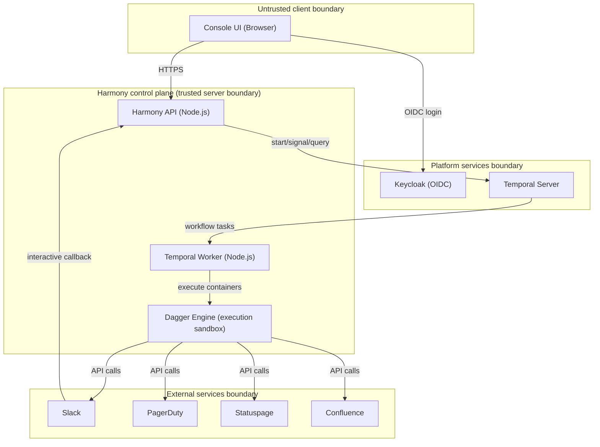

# Incident Lifecycle Threat Model

**Version:** 1.0.0
**Date:** 2026-02-02
**Review Cadence:** Quarterly

---

## 1. System Overview

The Incident Lifecycle Blueprint Suite orchestrates incident management through Temporal workflows, integrating with external services (Statuspage, Confluence, PagerDuty, Slack) and executing remediation actions via runbooks.

### Components in Scope

This diagram shows the **primary trust boundaries and data flows** relevant to the incident lifecycle suite:



Notes:
- Slack interactive callbacks are handled by the Console server integration router at `POST /api/integrations/slack/interactive`.
- Slack request signature verification is enforced when `SLACK_SIGNING_SECRET` is configured; local development may bypass verification.

---

## 2. Threat Actors

| Actor | Capability | Motivation |
|-------|------------|------------|
| **External Attacker** | Network access, credential stuffing | Data theft, disruption |
| **Malicious Insider** | Valid credentials, system knowledge | Data exfiltration, sabotage |
| **Compromised Agent** | Service account, API access | Lateral movement, data access |
| **Supply Chain** | Dependency poisoning | Code execution, backdoors |

---

## 3. Assets

| Asset | Classification | Impact if Compromised |
|-------|---------------|----------------------|
| API credentials (PagerDuty, Statuspage) | RESTRICTED | External service impersonation |
| Incident data | INTERNAL/CONFIDENTIAL | Privacy breach, reputation |
| Runbook execution capability | INTERNAL | Unauthorized system changes |
| Approval authority | INTERNAL | Bypass security controls |
| Audit logs | INTERNAL | Cover tracks, compliance failure |
| Post-mortem content | INTERNAL | Intellectual property leak |

---

## 4. Threat Analysis (STRIDE)

### 4.1 Spoofing

| ID | Threat | Component | Mitigation | Status |
|----|--------|-----------|------------|--------|
| S1 | Attacker impersonates SRE to approve actions | HITL Approval | OIDC authentication, role verification | Implemented |
| S2 | Agent uses another agent's service account | Agent Identity | Dedicated service accounts (UIM-001) | Implemented |
| S3 | Slack callback spoofing for approvals | Slack Integration | Slack request signature verification middleware (`createSlackVerificationMiddleware`) | Implemented (when `SLACK_SIGNING_SECRET` is set) |
| S4 | Slack callback replay attack | Slack Integration | Timestamp freshness window (5 min) checked during signature verification | Implemented (when `SLACK_SIGNING_SECRET` is set) |

### 4.2 Tampering

| ID | Threat | Component | Mitigation | Status |
|----|--------|-----------|------------|--------|
| T1 | Modify runbook content before execution | Runme Runner | Git-backed runbooks, checksum validation | Partial |
| T2 | Alter workflow state in Temporal | Temporal | Temporal's built-in integrity | Implemented |
| T3 | Modify incident timeline events | Timeline | Append-only timeline, signed events | Planned |
| T4 | Tamper with approval decision | Approval Signal | Cryptographic signing | Planned |

### 4.3 Repudiation

| ID | Threat | Component | Mitigation | Status |
|----|--------|-----------|------------|--------|
| R1 | Deny having approved an action | HITL Approval | Immutable audit log with user ID | Implemented |
| R2 | Deny running a destructive runbook | Runme Runner | Execution trace with initiator | Implemented |
| R3 | Claim incident was already resolved | Close-out | Temporal workflow history | Implemented |

### 4.4 Information Disclosure

| ID | Threat | Component | Mitigation | Status |
|----|--------|-----------|------------|--------|
| I1 | Secrets exposed in logs | All capabilities | SecretSchema redaction (GOS-001) | Implemented |
| I2 | Credentials in Slack messages | Slack Integration | No credentials in message blocks | Implemented |
| I3 | Post-mortem exposes sensitive data | Confluence | Classification-based template fields | Implemented |
| I4 | API keys in runbook output | Runme Runner | Output sanitization | Partial |
| I5 | Incident details leaked via Statuspage | Statuspage | Public/private incident separation | Implemented |

### 4.5 Denial of Service

| ID | Threat | Component | Mitigation | Status |
|----|--------|-----------|------------|--------|
| D1 | Flood Temporal with fake incidents | Workflow Engine | Rate limiting, authentication | Implemented |
| D2 | Exhaust external API quotas | All connectors | Rate limiting, circuit breaker | Partial |
| D3 | Block approval queue | HITL Approval | Timeout with auto-escalation | Implemented |
| D4 | Runbook execution hang | Runme Runner | Execution timeout | Implemented |

### 4.6 Elevation of Privilege

| ID | Threat | Component | Mitigation | Status |
|----|--------|-----------|------------|--------|
| E1 | Viewer attempts to execute runbook | Runme Runner | Role check before execution | Implemented |
| E2 | Responder tries to archive channel | Slack Integration | Role-based action filtering | Implemented |
| E3 | Agent exceeds granted scopes | All capabilities | OCS scope enforcement | Implemented |
| E4 | Bypass HITL via direct API call | Workflow Engine | HITL gates in workflow, not API | Implemented |
| E5 | Exploit runbook to gain shell access | Runme Runner | Sandboxed Dagger execution | Implemented |

---

## 4.7 Implementation Notes (Current Constraints)

- **Slack approvals do not currently carry role claims**: Slack interactive approval payloads set `approverRoles: []` (see `packages/apps/console/server/integrations/http/slack-interactive-handler.ts`). Any workflow logic that requires `requiredRoles` may treat Slack-driven approvals as insufficient until role mapping is implemented.
- **Signature verification is configuration-dependent**: the Slack interactive endpoint enforces signature verification only when `SLACK_SIGNING_SECRET` is present. This is intentional to support local development, but production deployments should always set the signing secret.

---

## 5. Attack Trees

### 5.1 Unauthorized Incident Resolution

```
Goal: Close incident without proper authorization
├── Bypass HITL approval
│   ├── Spoof Slack approval message [S3] → Mitigated
│   ├── Replay old approval token [S4] → Mitigated
│   └── Compromise approver account [S1] → Requires MFA
├── Direct API manipulation
│   ├── Call close-out API directly [E4] → Mitigated
│   └── Modify Temporal state [T2] → Mitigated
└── Social engineering
    └── Trick approver into approving → Training, dual approval for P1
```

### 5.2 Malicious Runbook Execution

```
Goal: Execute unauthorized commands via runbook
├── Inject malicious runbook
│   ├── Commit to runbooks/ directory [T1] → Git review required
│   └── Modify runbook at runtime [T1] → Checksum validation (planned)
├── Escalate from low-severity incident
│   └── Create P4 to test malicious runbook → HITL required for all runbooks
└── Use legitimate runbook maliciously
    └── Redis restart on wrong cluster → Input validation, approval required
```

---

## 6. Security Controls Matrix

| Control | STRIDE Coverage | Implementation |
|---------|-----------------|----------------|
| OIDC Authentication | S | Keycloak integration |
| Role-Based Access Control | E | OCS requiredScopes |
| Slack Signature Verification | S | `createSlackVerificationMiddleware` applied to `/slack/interactive` when `SLACK_SIGNING_SECRET` is set |
| Audit Logging | R | GOS-001 structured logs |
| Secret Redaction | I | SecretSchema in OCS |
| Rate Limiting | D | Per-capability limits |
| Execution Timeout | D | Temporal activity timeout |
| Sandboxed Execution | E | Dagger containers |
| HITL Approval Gates | S, E | `waitForApproval()` |
| Immutable Workflow History | T, R | Temporal event sourcing |

---

## 7. Residual Risks

| Risk | Severity | Likelihood | Mitigation Plan |
|------|----------|------------|-----------------|
| Runbook checksum bypass | Medium | Low | Implement signed runbooks |
| External API credential theft | High | Low | Rotate credentials, monitor usage |
| Approval decision tampering | Medium | Very Low | Implement cryptographic signing |
| Supply chain attack on dependencies | High | Low | Dependency scanning, SBOM |

---

## 8. Recommendations

### Immediate (P0)

1. **Enable MFA for all incident-approver role holders**
2. **Implement rate limiting on all external API connectors**

### Short-term (P1)

1. **Add runbook checksum validation** before execution
2. **Implement approval decision signing** with user certificate
3. **Add dependency vulnerability scanning** to CI pipeline

### Long-term (P2)

1. **Hardware security module (HSM)** for signing operations
2. **Zero-trust network** for Temporal worker communication
3. **Formal security audit** of Dagger execution sandbox

---

## 9. Review History

| Date | Reviewer | Changes |
|------|----------|---------|
| 2026-02-02 | Initial | Initial threat model |

---

## 10. Related Documents

- [Incident Lifecycle RBAC](/docs/security/incident-lifecycle-rbac.md)
- [UIM-001 Unified Identity Model](/.cursor/skills/unified-identity-model/SKILL.md)
- [GOS-001 Golden Observability Standard](/.cursor/skills/golden-observability/SKILL.md)
- [ADR-002 Incident Management Architecture](/docs/adr/ADR-002-incident-management.md)
