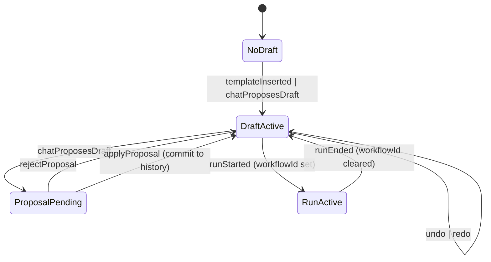

## Workbench user flows + state model (code-derived)

**Role**: Product Architect + UX Systems Analyst + Platform Engineer embedded in Harmony.

**Core rule**: **Code is the source of truth**. When a flow is not supported by the code, it is explicitly marked as **NOT IMPLEMENTED** and captured as a **gap** (with smallest viable unblocker).

### What “user flow” means (definition)

A **user flow** is a deterministic, testable sequence that:
- starts at a concrete **entry point** (UI route, API endpoint, webhook, agent hook)
- causes explicit **state transitions** (UI state, persisted artifacts, workflow executions, approvals)
- transforms **inputs → outputs** via concrete **contracts/schemas**
- ends at an **exit point** (completion, handoff, automation takeover, or failure state)

### Flow IDs (numbered use cases)

- **CUR-XX**: current / shippable today (code supports end-to-end)
- **I1-XX**: workbench iteration 1 (next iteration) — may be **PARTIAL/NOT IMPLEMENTED**
- **I2-XX**: workbench iteration 2 (next-next iteration) — may be **PARTIAL/NOT IMPLEMENTED**
- **D6-XX**: ~6 months direction — may be **PARTIAL/NOT IMPLEMENTED**

Each flow below includes:
- **Status**: EXISTS / PARTIAL / NOT IMPLEMENTED
- **Personas**: DevSecOps Engineer / Leadership / End Users / AI Agent
- **Validation level**: Contract-only / Runtime smoke / Day-two ops
- **Entry points**: concrete routes/endpoints
- **Steps**: human/system/agent steps
- **State transitions**: what changes
- **Inputs → outputs**: contracts and artifacts

---

## Code-derived entry points (UI + API + agent)

### UI routes (Console)

- **Workbench**: `/workbench` (`packages/apps/console/client/src/pages/workbench-page.tsx`)
- **Workbench Library**: `/workbench/library` (`packages/apps/console/client/src/pages/library-page.tsx`)
- **Workbench Shared**: `/workbench/shared?d=...` (`packages/apps/console/client/src/pages/workbench-shared-page.tsx`)
- **Capabilities catalog**: `/capabilities` (route name inferred; page: `packages/apps/console/client/src/pages/capabilities-catalog.tsx`)
- **Dashboard**: `/` or `/dashboard` (route name inferred; page: `packages/apps/console/client/src/pages/dashboard.tsx`)
- **Ops Console (NOC-style)**: `/console` (route name inferred; page: `packages/apps/console/client/src/pages/ops-console.tsx`)
- **Operations Hub**: `/operations` (page: `packages/apps/console/client/src/pages/operations-hub.tsx`)
- **Runbooks**: `/runbooks` (page: `packages/apps/console/client/src/pages/runbooks.tsx`)
- **Incidents**: `/incidents` and `/incidents/:id` (page: `packages/apps/console/client/src/pages/incidents.tsx`)
- **Timeline**: `/timeline` (page: `packages/apps/console/client/src/pages/timeline.tsx`)
- **Service catalog**: `/services` and `/services/:id` (page: `packages/apps/console/client/src/pages/service-catalog.tsx`)
- **Compliance overview**: `/compliance` (page: `packages/apps/console/client/src/pages/compliance/overview.tsx`) **(currently mock data)**
- **SSP editor**: `/compliance/ssp` (page: `packages/apps/console/client/src/pages/compliance/ssp-editor.tsx`) **(currently mock data)**
- **Workflows page**: `/workflows` (page: `packages/apps/console/client/src/pages/workflows.tsx`) **(explicit placeholder)**
- **User/account section**: **(missing)** — no `/account` / `/users/me` UI route registered in `packages/apps/console/client/src/App.tsx`

### HTTP APIs (Console server)

Mounted in `packages/apps/console/server/routes.ts`.

**Workbench + MCP**
- `POST /api/chat` (Vercel AI SDK streaming) (`packages/apps/console/server/routers/chat-router.ts`)
- `GET /api/mcp/tools`, `POST /api/mcp/tools/refresh` (`packages/apps/console/server/routers/mcp-tools-router.ts`)
- `GET /api/templates` (template manifest) (`packages/apps/console/server/routers/templates-router.ts`)
- `POST /api/workbench/sessions` (workbench-server proxy/launcher) (`packages/apps/console/server/routers/workbench-router.ts`)
- `GET/POST /api/workbench/approvals/log` (restricted tool approval audit log) (`packages/apps/console/server/routers/workbench-router.ts`)
- `POST /api/workbench/telemetry`, `GET /api/workbench/metrics` (`packages/apps/console/server/routers/workbench-router.ts`)

**Actions / approvals / ops workflows**
- `GET /api/actions/catalog`
- `POST /api/actions/execute`
- `GET /api/actions/approvals/pending`
- `POST /api/actions/approvals`
- `GET /api/actions/executions`
- `GET /api/actions/executions/:runId/status`
  (`packages/apps/console/server/actions/http/actions-router.ts`)

**Events / incidents**
- `GET /api/activity/stream` (mounted via events router) (`packages/apps/console/server/events/http/events-router.ts`)
- `PATCH /api/events/:id` (toggle resolved, update payload)
- `POST /api/events/:eventId/resolve` (resolve blocker)
- `GET/POST /api/events/:eventId/comments`
- `GET /api/incidents/:incidentId/timeline` (`packages/apps/console/server/incidents/http/incidents-router.ts`)

**Workflows (Temporal)**
- `POST /api/workflows/run-blueprint`
- `GET /api/workflows/:id` (describe)
- `GET /api/workflows/:id/progress` (step progress from history) **(exists server-side)**
- `POST /api/workflows/:id/cancel`
- `GET /api/workflows/:id/result`
  (`packages/apps/console/server/http/workflows-router.ts`)

**Integrations**
- `POST /api/integrations/slack/events`
- `POST /api/integrations/slack/interactive`
- `POST /api/integrations/:source/webhook`
- `POST /api/sync/all`, `POST /api/sync/:source`
- `GET /api/integrations/status`
  (`packages/apps/console/server/integrations/http/integrations-router.ts`)

**SQL**
- `GET /api/sql/templates`
- `POST /api/sql/execute` (`packages/apps/console/server/sql/http/sql-router.ts`)

**Security**
- `GET /api/security/summary`
- `GET /api/security/findings`
- `POST /api/security/findings/:id/resolve`
- `POST /api/security/webhooks/:tool`
  (`packages/apps/console/server/security/http/security-router.ts`)

**Agent (non-Workbench)**
- `POST /api/agent/chat`
- `POST /api/agent/generate-report`
- `GET /api/agent/tools`
- `GET /api/agent/conversation/:id`
- `POST /api/agent/blueprint/propose`
  (`packages/apps/console/server/agent/http/agent-router.ts`)

**Users**
- `GET /api/users/:identifier/profile` (`packages/apps/console/server/users/http/users-router.ts`)

---

## Glossary (canonical terms)

- **Draft (BlueprintDraft)**: IR shown on Workbench canvas (`packages/apps/console/client/src/features/workbench/types.ts`, schema referenced in `docs/adr/ADR-003-workbench-state-model.md`).
- **Proposal / pending draft**: agent-proposed draft requiring Apply/Reject (`packages/apps/console/client/src/pages/workbench-page.tsx`).
- **Template**: workflow template served by `/api/templates` (router: `packages/apps/console/server/routers/templates-router.ts`).
- **MCP tool catalog**: served by `/api/mcp/tools` (router: `packages/apps/console/server/routers/mcp-tools-router.ts`).
- **Action**: executable operational action with required params and risk gating (`/api/actions/*`, UI in `operations-hub.tsx` and `runbooks.tsx`).
- **Execution**:
  - **Workbench execution**: Temporal workflow run started via `/api/workflows/run-blueprint` (UI: `run-blueprint-dialog.tsx`, `execution-timeline.tsx`)
  - **Ops execution**: action execution started via `/api/actions/execute` (status via `/api/actions/executions/:runId/status`)
- **Approval**:
  - Workbench restricted-tool approval log: `/api/workbench/approvals/log`
  - Ops action approvals: `/api/actions/approvals` + `/api/actions/approvals/pending`
- **Incident**: an activity event with `contextType === "incident"` (UI: `incidents.tsx`; data: `/api/activity/stream`).

---

## Milestone flow catalogs (≥10 flows per milestone)

### Current (CUR) — flows supported by code today

> These are **EXISTS** unless explicitly marked otherwise.

#### CUR-01 — Workbench onboarding & help loop
- **Status**: EXISTS
- **Personas**: End Users, Leadership
- **Validation level**: Contract-only
- **Entry points**: `/workbench`
- **Steps**: first-time onboarding opens → user dismisses/finishes → Help allows restart
- **State transitions**: onboarding localStorage “seen” toggled
- **Key UI**: `workbench-page.tsx`, `workbench-onboarding.tsx`, `workbench-help-sheet.tsx`

#### CUR-02 — Library search → preview → insert template into Workbench
- **Status**: EXISTS
- **Personas**: End Users, AI Agent (template awareness), Leadership
- **Validation level**: Contract-only
- **Entry points**: `/workbench/library` → `/workbench?templateId=...`
- **Inputs → outputs**: template manifest (`GET /api/templates`) → `BlueprintDraft` on canvas
- **Key files**: `library-page.tsx`, `templates-router.ts`, `workbench-page.tsx`

#### CUR-03 — Capabilities discovery → “Use in Workbench”
- **Status**: EXISTS
- **Personas**: DevSecOps Engineer, End Users, AI Agent
- **Validation level**: Contract-only
- **Entry points**: Capabilities catalog page (`capabilities-catalog.tsx`)
- **Steps**: filter/search tools → open tool detail sheet → copy tool ID / jump to Workbench
- **Inputs → outputs**: MCP snapshot (`GET /api/mcp/tools`) → user selects tool for workflow design

#### CUR-04 — MCP tool catalog freshness loop (refresh vs restart)
- **Status**: EXISTS
- **Personas**: DevSecOps Engineer, AI Agent
- **Validation level**: Contract-only
- **Entry points**: Capabilities page refresh button; API `POST /api/mcp/tools/refresh`
- **State transitions**: `manifest.generated_at` updates in tool snapshot
- **Key file**: `mcp-tools-router.ts`

#### CUR-05 — Workbench chat propose → apply/reject proposal
- **Status**: EXISTS
- **Personas**: End Users, AI Agent
- **Validation level**: Contract-only (or Runtime smoke if live model)
- **Entry points**: `/workbench` + `POST /api/chat`
- **State transitions**: `pendingDraft` set → apply commits to history
- **Key files**: `workbench-page.tsx`, `agent-chat-panel.tsx`, `chat-router.ts`

#### CUR-06 — Workbench proposal blocked by unknown tools / restricted tools
- **Status**: EXISTS (blocking behavior)
- **Personas**: End Users, DevSecOps Engineer, AI Agent, Leadership
- **Validation level**: Contract-only
- **Entry points**: `/workbench` proposal dialog
- **State transitions**: `applyError` set; approval checkbox gating required
- **Key files**: `workbench-page.tsx`

#### CUR-07 — Node info sheet: required fields + JSON properties apply
- **Status**: EXISTS
- **Personas**: End Users, DevSecOps Engineer
- **Validation level**: Contract-only
- **Entry points**: select node in canvas
- **Inputs → outputs**: tool input schema (`McpTool.inputSchema`) → node properties updated in draft history
- **Key files**: `node-info-sheet.tsx`

#### CUR-08 — Node info sheet: open Swagger/GraphiQL via workbench-server session
- **Status**: EXISTS (runtime depends on workbench-server)
- **Personas**: DevSecOps Engineer, End Users, AI Agent (context to instruct)
- **Validation level**: Runtime smoke
- **Entry points**: node info “Open Swagger/Open GraphQL” → `POST /api/workbench/sessions`
- **External dependency**: workbench-server at `WORKBENCH_SERVER_URL` (default `http://127.0.0.1:8787`)
- **Key files**: `node-info-sheet.tsx`, `workbench-router.ts`

#### CUR-09 — Run blueprint workflow via Run dialog + observe timeline
- **Status**: EXISTS
- **Personas**: End Users, DevSecOps Engineer, Leadership
- **Validation level**: Runtime smoke
- **Entry points**: Workbench Run dialog → `POST /api/workflows/run-blueprint`
- **State transitions**: `activeWorkflowId` set → polling `/api/workflows/:id`
- **Key files**: `run-blueprint-dialog.tsx`, `execution-timeline.tsx`, `workflows-router.ts`

#### CUR-10 — Cancel a Temporal workflow run
- **Status**: EXISTS (API) / PARTIAL (UI exposure in Workbench is not present)
- **Personas**: DevSecOps Engineer, AI Agent
- **Validation level**: Runtime smoke
- **Entry points**: `POST /api/workflows/:id/cancel`
- **Key files**: `workflows-router.ts`

#### CUR-11 — Get workflow step progress (server-side)
- **Status**: EXISTS (API) / NOT IMPLEMENTED (Workbench UI does not consume it yet)
- **Personas**: DevSecOps Engineer, End Users, AI Agent
- **Validation level**: Runtime smoke
- **Entry points**: `GET /api/workflows/:id/progress`
- **Output**: step-level progress derived from Temporal history (`deriveWorkflowProgressFromHistory`)
- **Key files**: `workflows-router.ts`, `workflow-progress.ts`

#### CUR-12 — Workbench share link → read-only shared view
- **Status**: EXISTS
- **Personas**: End Users, Leadership
- **Validation level**: Contract-only
- **Entry points**: Share button → `/workbench/shared?d=...`
- **Key files**: `drafting-canvas.tsx`, `share-draft.ts`, `workbench-shared-page.tsx`

#### CUR-13 — Incidents list → incident detail → mark resolved/open
- **Status**: EXISTS
- **Personas**: DevSecOps Engineer, Leadership, End Users
- **Validation level**: Contract-only
- **Entry points**: `/incidents`, `/incidents/:id`
- **Inputs → outputs**: `GET /api/activity/stream` → `PATCH /api/events/:id`
- **Key files**: `incidents.tsx`, `events-router.ts`

#### CUR-14 — Incident detail: show pending approvals + executions (scoped)
- **Status**: EXISTS
- **Personas**: DevSecOps Engineer, Leadership
- **Validation level**: Contract-only
- **Entry points**: incident detail tabs
- **Inputs**: `GET /api/actions/approvals/pending?incidentId=...`, `GET /api/actions/executions?incidentId=...`
- **Key files**: `incidents.tsx`, `actions-router.ts`

#### CUR-15 — Global timeline: events + executions audit feed
- **Status**: EXISTS
- **Personas**: DevSecOps Engineer, Leadership
- **Validation level**: Contract-only
- **Entry points**: `/timeline`
- **Inputs**: `GET /api/activity/stream`, `GET /api/actions/executions`
- **Key files**: `timeline.tsx`

#### CUR-16 — Runbooks: browse markdown → execute linked action (if registered)
- **Status**: EXISTS
- **Personas**: DevSecOps Engineer, End Users
- **Validation level**: Contract-only (browse) + Runtime smoke (execute)
- **Entry points**: `/runbooks`, `GET /api/runbooks`, `GET /api/runbooks/:id`
- **Execution**: `POST /api/actions/execute` with required params + reasoning
- **Key files**: `runbooks.tsx`, `runbooks-router.ts`, `actions-router.ts`

#### CUR-17 — Operations Hub: execute action → approval gating → status polling
- **Status**: EXISTS
- **Personas**: DevSecOps Engineer, Leadership
- **Validation level**: Runtime smoke
- **Entry points**: `/operations`
- **Inputs → outputs**: `POST /api/actions/execute` → (maybe) `requiresApproval` → `GET /api/actions/executions/:runId/status`
- **Key files**: `operations-hub.tsx`, `actions-router.ts`

#### CUR-18 — Operations Hub: approve/reject pending approvals
- **Status**: EXISTS
- **Personas**: DevSecOps Engineer, Leadership
- **Validation level**: Runtime smoke
- **Entry points**: `/operations`
- **Inputs → outputs**: `GET /api/actions/approvals/pending` → `POST /api/actions/approvals`
- **Key files**: `operations-hub.tsx`, `actions-router.ts`

#### CUR-19 — Operations Hub: SQL templates → execute query
- **Status**: EXISTS
- **Personas**: DevSecOps Engineer, End Users
- **Validation level**: Runtime smoke
- **Entry points**: `/operations`
- **Inputs → outputs**: `GET /api/sql/templates` → `POST /api/sql/execute`
- **Key files**: `operations-hub.tsx`, `sql-router.ts`

#### CUR-20 — Integrations: ingest external events (Slack/webhooks) + sync sources
- **Status**: EXISTS
- **Personas**: DevSecOps Engineer, AI Agent (downstream), Leadership
- **Validation level**: Runtime smoke
- **Entry points**:
  - `POST /api/integrations/slack/events`
  - `POST /api/integrations/:source/webhook`
  - `POST /api/sync/all`, `POST /api/sync/:source`
  - `GET /api/integrations/status`
- **Key files**: `integrations-router.ts`

#### CUR-21 — Security: view findings/summary + ingest via webhook + resolve
- **Status**: EXISTS (API) / PARTIAL (UI location depends on `SecuritySection`)
- **Personas**: DevSecOps Engineer, Leadership
- **Validation level**: Runtime smoke
- **Entry points**: `GET /api/security/summary`, `GET /api/security/findings`, `POST /api/security/webhooks/:tool`, `POST /api/security/findings/:id/resolve`
- **Key files**: `security-router.ts`, `dashboard.tsx` (security section)

#### CUR-22 — Agent (non-Workbench): chat with context (dashboard/ops-console)
- **Status**: EXISTS
- **Personas**: End Users, DevSecOps Engineer, AI Agent (as tool runner)
- **Validation level**: Contract-only
- **Entry points**: `POST /api/agent/chat` from `dashboard.tsx` and `ops-console.tsx`
- **Key files**: `agent-router.ts`, `dashboard.tsx`, `ops-console.tsx`

#### CUR-23 — Agent tools discovery + conversation retrieval
- **Status**: EXISTS
- **Personas**: AI Agent, DevSecOps Engineer (debug)
- **Validation level**: Contract-only
- **Entry points**: `GET /api/agent/tools`, `GET /api/agent/conversation/:id`
- **Key files**: `agent-router.ts`

> Current milestone includes **≥10** flows; above provides **23**.

#### CUR-24 — Workbench “explore outward” fan-out: open Capabilities Catalog, then return to Workbench
- **Status**: EXISTS
- **Personas**: End Users, DevSecOps Engineer, AI Agent
- **Validation level**: Contract-only
- **Entry points**: `/workbench` → capabilities catalog page (`capabilities-catalog.tsx`) → “Open Workbench”
- **Steps**:
  - User leaves Workbench to browse tools (filters, classification, outbound allowlist, required scopes)
  - User returns to Workbench to apply learnings (manual insertion/config)
- **State transitions**: none persisted; context is currently “in the user’s head” (no deep-link insertion yet)
- **Gap note**: see I1-08 (“deep-link inserts tool node on canvas”)

#### CUR-25 — Workbench “node-level explore outward” via playground launch, then return
- **Status**: EXISTS (runtime dependent)
- **Personas**: End Users, DevSecOps Engineer
- **Validation level**: Runtime smoke
- **Entry points**: Workbench node info → `POST /api/workbench/sessions` → new tab → return to Workbench
- **Critical nuance (code-truth)**:
  - Today the node info sheet always renders **both** “Open Swagger” and “Open GraphQL” buttons (`node-info-sheet.tsx`).
  - There is no per-capability affordance that hides one/both based on tool metadata.
  - Provider is inferred from node type prefix (`jira.*`, `gitlab.*`, else `github`) which affects session request body.
- **Gap note**: tool metadata needs to express “hasOpenAPI/hasGraphQL/hasNeither” to make the UI correct for every capability.

#### CUR-26 — Workbench execution UX treatment (today): inline timeline + link-out “View”
- **Status**: EXISTS / PARTIAL
- **Personas**: End Users, DevSecOps Engineer, Leadership
- **Validation level**: Runtime smoke
- **Entry points**: Workbench Run dialog
- **Observables (code-truth)**:
  - Inline `ExecutionTimeline` is shown in the Run dialog and polls `GET /api/workflows/:id`.
  - The dialog includes a “View” link to `/workflows/:workflowId` (`run-blueprint-dialog.tsx`).
  - The `/workflows/:id` UI is currently a placeholder (`workflows.tsx`), and also suggests using Temporal UI (`http://localhost:8233`).
- **Implication**: end-to-end “stay in Workbench for execution details” is not currently supported beyond the timeline/status summary.

#### CUR-27 — Workbench → Ops fan-out: use incidents/ops hub/runbooks as adjacent context surfaces
- **Status**: EXISTS (as separate pages) / PARTIAL (context handoff)
- **Personas**: DevSecOps Engineer, End Users, Leadership
- **Validation level**: Contract-only
- **Entry points**: Incidents page links to Ops Hub and Runbooks (see `incidents.tsx`)
- **Flow shape**:
  - Incident detail: Overview → click “Open Operations Hub” or “Browse runbooks”
  - User performs actions and returns to incident timeline for audit review
- **Gap note**: Workbench itself does not yet provide first-class “switch to ops context” affordances; handoff is currently URL navigation without preserving a shared context object.

---

### Workbench iteration 1 (I1) — next iteration, code-grounded targets

> These are explicitly marked **PARTIAL/NOT IMPLEMENTED** when the code does not yet support the end-to-end behavior.

#### I1-01 — Deterministic Workbench chat fixture mode for E2E
- **Status**: NOT IMPLEMENTED
- **Personas**: DevSecOps Engineer, AI Agent, End Users
- **Validation level**: Contract-only
- **Entry points**: `POST /api/chat` (`chat-router.ts`)
- **Why code implies this is needed**: Workbench client uses streaming chat; E2E can’t rely on nondeterministic model output
- **Smallest viable unblocker**: gate fixture mode by env + scenario ID and return deterministic streamed draft/messages

#### I1-02 — Stable selectors for Workbench chat + canvas + run affordances
- **Status**: PARTIAL (library + node info already have test IDs; chat/canvas/run-open do not)
- **Personas**: DevSecOps Engineer, End Users
- **Validation level**: Contract-only
- **Smallest viable unblocker**: add `data-testid` to chat panel/input/send, canvas root, run open/submit buttons

#### I1-03 — Chat-driven “run this workflow now” by calling existing workflow API
- **Status**: NOT IMPLEMENTED
- **Personas**: End Users, AI Agent, DevSecOps Engineer
- **Validation level**: Runtime smoke
- **Code anchor**: run endpoint exists (`POST /api/workflows/run-blueprint`), but chat does not invoke it
- **Smallest viable unblocker**: add a deterministic agent tool that calls the endpoint and posts runId/workflowId to chat

#### I1-04 — Chat-driven workflow cancel using existing cancel endpoint
- **Status**: NOT IMPLEMENTED
- **Personas**: AI Agent, DevSecOps Engineer
- **Validation level**: Runtime smoke
- **Code anchor**: cancel endpoint exists (`POST /api/workflows/:id/cancel`)
- **Unblocker**: expose cancel tool + pass `activeWorkflowId` (already sent in Workbench chat body)

#### I1-05 — Per-step execution status in Workbench using existing `/progress`
- **Status**: NOT IMPLEMENTED (API exists)
- **Personas**: DevSecOps Engineer, End Users
- **Validation level**: Runtime smoke
- **Code anchor**: `GET /api/workflows/:id/progress`
- **Unblocker**: poll progress and map step progress to nodes (requires mapping strategy)

#### I1-06 — Workbench “workflow result” panel after completion
- **Status**: NOT IMPLEMENTED (API exists)
- **Personas**: End Users, Leadership
- **Validation level**: Runtime smoke
- **Code anchor**: `GET /api/workflows/:id/result`
- **Unblocker**: show result/errors inline (reduce dependency on Temporal UI)

#### I1-07 — Template insertion conflict prompt (“replace current draft?”)
- **Status**: NOT IMPLEMENTED
- **Personas**: End Users
- **Validation level**: Contract-only
- **Code anchor**: template insertion currently replaces draft unconditionally (`workbench-page.tsx`)
- **Unblocker**: add guard dialog when a current draft exists

#### I1-08 — “Use tool in Workbench” deep-link inserts tool node on canvas
- **Status**: NOT IMPLEMENTED
- **Personas**: End Users, AI Agent
- **Validation level**: Contract-only
- **Code anchor**: Capabilities catalog navigates to `/workbench` but does not insert node
- **Unblocker**: support query param (e.g. `?insertToolId=`) and call existing insert method

#### I1-09 — Incident → Operations Hub handoff with incident-scoped context preserved
- **Status**: PARTIAL
- **Personas**: DevSecOps Engineer, Leadership
- **Validation level**: Runtime smoke
- **Code anchor**: incident detail links to Operations Hub but does not pass incidentId context explicitly
- **Unblocker**: add query params for incidentId/serviceTags and have ops hub scope approvals/executions accordingly

#### I1-10 — Dashboard “ops commands” produce deterministic event entries
- **Status**: EXISTS (Slack command simulation) / PARTIAL (depends on integrations wiring)
- **Personas**: Leadership, DevSecOps Engineer
- **Validation level**: Contract-only
- **Code anchor**: dashboard issues Slack command requests via `/api/integrations/slack/events`
- **Unblocker**: add explicit UI feedback linking created event id to incident list/timeline

> Iteration 1 includes **≥10** flows (10 listed).

#### I1-11 — Capability-specific explore affordances (OpenAPI vs GraphQL vs none)
- **Status**: NOT IMPLEMENTED
- **Personas**: End Users, DevSecOps Engineer
- **Validation level**: Contract-only
- **Problem**: some capabilities will not have Swagger or GraphiQL, but the UI currently always shows both buttons.
- **Smallest viable unblocker**:
  - Extend MCP tool metadata with a field like `exploreSurfaces: ["openapi" | "graphql"]` (or booleans).
  - Render buttons conditionally in `node-info-sheet.tsx`.

#### I1-12 — OAuth / credential initiation flow as part of tool exploration
- **Status**: NOT IMPLEMENTED (no OAuth UI flow observed)
- **Personas**: End Users, DevSecOps Engineer, AI Agent
- **Validation level**: Contract-only
- **Code-derived constraint**:
  - Integrations are configured via env vars and webhook verification, not interactive OAuth (`integrations-router.ts`).
  - No `/oauth/*` UI or token exchange flows found in Console code.
- **Smallest viable unblocker**: introduce a credential/connection model (connection status, “connect” CTA, callback handler), and attach it to tool required scopes.

#### I1-13 — Workbench ↔ Ops context bridge (portable “context object”)
- **Status**: NOT IMPLEMENTED
- **Personas**: DevSecOps Engineer, End Users, AI Agent
- **Validation level**: Contract-only
- **Goal**: fluid transitions between Workbench drafts and Ops actions/incidents without losing context.
- **Smallest viable unblocker**: define a minimal “context envelope” that can be passed via URL/state (incidentId, serviceTags, selected tool IDs, active workflowId) and re-hydrated on arrival.

---

### Workbench iteration 2 (I2) — next-next iteration, code-grounded targets

#### I2-01 — Unified “audit lineage” for Workbench draft → workflow run → telemetry
- **Status**: NOT IMPLEMENTED (partial telemetry exists)
- **Personas**: Leadership, DevSecOps Engineer, AI Agent
- **Validation level**: Day-two ops
- **Code anchors**:
  - Workbench telemetry exists (`/api/workbench/telemetry`, `/api/workbench/metrics`)
  - Workflows run API exists
- **Unblocker**: propagate durable IDs across surfaces (draftId/workflowId/runId) and include in metrics/logs consistently

#### I2-02 — Workbench approvals include incident/workflow context
- **Status**: PARTIAL
- **Personas**: Leadership, DevSecOps Engineer
- **Validation level**: Contract-only
- **Code anchor**: `/api/workbench/approvals/log` already accepts context fields
- **Unblocker**: pass incidentId/workflowId/contextType from Workbench when available

#### I2-03 — Incident detail shows actions history across both action executions and workflow runs
- **Status**: PARTIAL
- **Personas**: DevSecOps Engineer, Leadership
- **Validation level**: Day-two ops
- **Code anchor**: incident detail already joins events + action executions client-side; incident timeline API exists
- **Unblocker**: add Temporal workflow runs into incident timeline (requires correlation keys)

#### I2-04 — Runbook execution “safe defaults” + approval UX in one place
- **Status**: PARTIAL
- **Personas**: DevSecOps Engineer, End Users
- **Validation level**: Runtime smoke
- **Code anchor**: runbooks execute actions; operations hub handles approvals
- **Unblocker**: unify “execute + approval review” loop without forcing navigation between pages

#### I2-05 — Integrations status → guided remediation checklist
- **Status**: NOT IMPLEMENTED
- **Personas**: DevSecOps Engineer
- **Validation level**: Contract-only
- **Code anchor**: `/api/integrations/status` exists; router enumerates required env var sets
- **Unblocker**: render required env vars and webhook verification state in UI

#### I2-06 — Security findings: first-class UI for triage + resolve with audit notes
- **Status**: PARTIAL
- **Personas**: DevSecOps Engineer, Leadership
- **Validation level**: Day-two ops
- **Code anchor**: security APIs exist
- **Unblocker**: UI for findings list/detail + resolve reason/comment

#### I2-07 — Service catalog detail page
- **Status**: NOT IMPLEMENTED (explicitly returns null)
- **Personas**: DevSecOps Engineer, End Users
- **Validation level**: Contract-only
- **Code anchor**: `ServiceDetailPage` stub in `service-catalog.tsx`; `/api/services/:id` exists
- **Unblocker**: implement detail view + links to runbooks/actions/incidents filtered by service tags

#### I2-08 — Workflow browsing UI backed by existing `/api/workflows`
- **Status**: NOT IMPLEMENTED (explicit placeholder UI)
- **Personas**: DevSecOps Engineer, Leadership
- **Validation level**: Runtime smoke
- **Code anchor**: `/api/workflows` exists; `/workflows` page explicitly says “not wired”
- **Unblocker**: implement listing/pagination and deep-link to workflow status/result/progress/cancel

#### I2-09 — Agent report generation surfaced in UI for leadership and incident review
- **Status**: PARTIAL (API exists)
- **Personas**: Leadership, DevSecOps Engineer, AI Agent
- **Validation level**: Contract-only
- **Code anchor**: `POST /api/agent/generate-report` exists
- **Unblocker**: UI surface to request/report + store/report history

#### I2-10 — Compliance pages backed by real config/state (not mock)
- **Status**: NOT IMPLEMENTED (currently mock)
- **Personas**: Leadership, DevSecOps Engineer
- **Validation level**: Contract-only
- **Code anchor**: `compliance/overview.tsx` and `compliance/ssp-editor.tsx` use mock objects
- **Unblocker**: API + persistence + RBAC for SSP and enforcement config

> Iteration 2 includes **≥10** flows (10 listed).

#### I2-11 — Workbench chat becomes multi-turn, not “single-shot draft return”
- **Status**: PARTIAL (prompt + summarizer exist; UX still centers on propose/apply)
- **Personas**: End Users, AI Agent
- **Validation level**: Contract-only
- **Code truth**:
  - The prompt system already encodes iteration and explain/refinement modes (`server/agent/prompts/blueprint-generation.ts`).
  - Workbench client parses drafts and explainStep; proposal gating is the primary UX.
- **Missing**:
  - explicit conversation states (e.g. “clarifying questions pending”, “awaiting template confirmation”, “execution monitoring mode”).
- **Unblocker**: formalize chat state machine and add UI affordances for confirmations, clarifications, and “continue/refine” loops.

#### I2-12 — Agent evals + regression tests attached to prompts/tools
- **Status**: NOT IMPLEMENTED (no agent eval harness observed in repo)
- **Personas**: DevSecOps Engineer, AI Agent, Leadership
- **Validation level**: Contract-only
- **Goal**: automatically test that prompts produce valid IR, respect tool catalogs, and handle refinement/clarification.
- **Unblocker**:
  - Create fixture-based eval cases for `buildBlueprintPlanningPrompt` + tool outputs.
  - Gate with CI (similar to existing prompt unit tests, but behavior-level).

---

### 6 months direction (D6) — code-informed, compliance-aware “inevitable” paths

> These are mostly **NOT IMPLEMENTED** today; they are grounded in existing primitives (events, actions, approvals, workflows, metrics, security).

#### D6-01 — End-to-end incident lifecycle cockpit
- **Status**: NOT IMPLEMENTED (primitives exist; cockpit is partial)
- **Personas**: DevSecOps Engineer, Leadership, End Users, AI Agent
- **Validation level**: Day-two ops
- **Unblocker**: unify incidents + actions + approvals + workflow runs + reports + metrics into one incident workspace

#### D6-02 — AI Agent “operate safely” loop (detect → propose → request approval → execute → verify → report)
- **Status**: NOT IMPLEMENTED (agent + approvals exist; orchestration incomplete)
- **Personas**: AI Agent, DevSecOps Engineer, Leadership
- **Validation level**: Day-two ops
- **Unblocker**: durable execution model + explicit approval gates + evidence capture + rollback/compensation patterns

#### D6-03 — Workbench becomes the unified builder for Ops actions and blueprints
- **Status**: NOT IMPLEMENTED
- **Personas**: End Users, DevSecOps Engineer, AI Agent
- **Validation level**: Runtime smoke
- **Unblocker**: bridge action catalog and workflow blueprints into a single design surface with safe previews

#### D6-04 — Cross-surface audit and compliance (SSP + approvals + executions)
- **Status**: NOT IMPLEMENTED
- **Personas**: Leadership, DevSecOps Engineer
- **Validation level**: Day-two ops
- **Unblocker**: real SSP persistence + evidence links + automated staleness checks + approval family gating

#### D6-05 — Integrations posture “as code”: config validation + drift detection
- **Status**: NOT IMPLEMENTED
- **Personas**: DevSecOps Engineer
- **Validation level**: Day-two ops
- **Unblocker**: config inventory + continuous verification + alerting on webhook verification changes

#### D6-06 — Security findings triage to remediation workflows (closed-loop)
- **Status**: NOT IMPLEMENTED
- **Personas**: DevSecOps Engineer, AI Agent
- **Validation level**: Day-two ops
- **Unblocker**: map finding → recommended action workflow → approval gate → verify fix → resolve

#### D6-07 — Service-centric golden paths (service page → incidents → runbooks → actions → workflows)
- **Status**: NOT IMPLEMENTED (service detail missing)
- **Personas**: End Users, DevSecOps Engineer, Leadership
- **Validation level**: Day-two ops
- **Unblocker**: implement service detail + linkage to incidents/timeline/actions/runbooks

#### D6-08 — Multi-tenant cost allocation & business value reporting
- **Status**: NOT IMPLEMENTED (some telemetry exists)
- **Personas**: Leadership
- **Validation level**: Day-two ops
- **Unblocker**: enforce `golden.*` observability attributes end-to-end and aggregate by cost center/business value

#### D6-09 — Deterministic E2E harness becomes gating (Tier 0/1 required)
- **Status**: NOT IMPLEMENTED (plan exists, harness not yet in repo)
- **Personas**: DevSecOps Engineer, Leadership
- **Validation level**: Contract-only + Runtime smoke
- **Unblocker**: Playwright harness + fixture mode + stable selectors + CI target

#### D6-10 — “Ops Copilot” automation boundaries: explicit autonomy + fallback playbooks
- **Status**: NOT IMPLEMENTED
- **Personas**: AI Agent, DevSecOps Engineer
- **Validation level**: Day-two ops
- **Unblocker**: policies for when agent may act, when it must request approval, and how it recovers safely

> 6-month direction includes **≥10** flows (10 listed).

#### D6-11 — Saved workflows / dashboards: persist “my workflows” + filtered metrics views
- **Status**: NOT IMPLEMENTED
- **Personas**: End Users, Leadership, DevSecOps Engineer
- **Validation level**: Day-two ops
- **Need (from code gaps)**:
  - Workbench emits telemetry and metrics, but there is no user-owned “workflow dashboard” concept.
  - Workflow browsing UI is not wired, so “recent runs I care about” is missing.
- **Unblocker**: persist “workflow favorites” keyed by userId; add filtered dashboard panels for runIds/workflowIds/draftIds.

#### D6-12 — Cost-aware golden paths (LLM + tool cost)
- **Status**: PARTIAL (server-side LLM cost budget exists)
- **Personas**: Leadership, DevSecOps Engineer, AI Agent
- **Validation level**: Day-two ops
- **Code truth**:
  - Chat router derives a `budgetKey` from user/session (`chat-router.ts`), and `OpenAIAgentService` enforces budgets and records token usage and totals.
  - Tool metadata includes `costFactor` and is surfaced in Capabilities catalog (`capabilities-catalog.tsx`).
- **Missing**:
  - UI exposure of budget/cost totals and controls.
- **Unblocker**: add user-visible “cost budget” panel and expose low-cardinality cost metrics (aligned to Golden Observability).

---

## Persona-driven flow discovery (mandatory personas)

> Each persona below is documented independently. Overlap is expected; the difference is *what the persona needs* and *how they succeed*.

### DevSecOps Engineer

#### Persona summary (code-grounded)

DevSecOps users operate the “day-two” surfaces: incidents, actions/runbooks, approvals, integrations, security, workflows, and audit. The code enforces **guardrails** via risk gating (approval required), role-based permission checks (server derives role from `x-user-role`), and conservative scoping (incident-scoped queries).

#### Entry points (with references)
- **Incidents UI**: `packages/apps/console/client/src/pages/incidents.tsx`
- **Operations Hub UI**: `packages/apps/console/client/src/pages/operations-hub.tsx`
- **Runbooks UI**: `packages/apps/console/client/src/pages/runbooks.tsx`
- **Timeline UI**: `packages/apps/console/client/src/pages/timeline.tsx`
- **Ops Console UI**: `packages/apps/console/client/src/pages/ops-console.tsx`
- **APIs**: actions (`actions-router.ts`), workflows (`workflows-router.ts`), integrations (`integrations-router.ts`), security (`security-router.ts`)

#### Primary flows (golden paths)
1. **Triage → remediate with approval**: CUR-13 → CUR-14 → CUR-17 → CUR-18 → CUR-15
2. **Runbook-first remediation**: CUR-16 → (if approval) CUR-18 → CUR-15
3. **Incident-scoped audit view**: CUR-13 → CUR-14 → CUR-15
4. **Integration ingest to incident visibility**: CUR-20 → CUR-13
5. **Workflow execution debugging**: CUR-09 → CUR-11 → CUR-10 → CUR-06 (as needed)

#### Alternative / failure flows
- **Approval required**: `POST /api/actions/execute` returns `requiresApproval: true` → user must use `POST /api/actions/approvals` (CUR-18)
- **Insufficient permissions**: actions router returns 403 (“Insufficient permissions”) when role cannot execute (actions-router.ts)
- **Temporal unavailable**: `/api/workflows/health` fails; run endpoints error
- **Integrations misconfigured**: sync endpoints return required env var lists (integrations-router.ts)

#### Capability & workflow map (code-derived)
- **Actions**: `GET /api/actions/catalog`, `POST /api/actions/execute`, approvals + executions status (`actions-router.ts`)
- **Temporal workflows**: run/describe/progress/cancel/result (`workflows-router.ts`)
- **Incident timeline**: `GET /api/incidents/:incidentId/timeline` (`incidents-router.ts`)
- **Runbooks**: `GET /api/runbooks`, `GET /api/runbooks/:id` (`runbooks-router.ts`)
- **Security**: findings/summary/webhooks (`security-router.ts`)
- **Integrations**: Slack, webhooks, sync/status (`integrations-router.ts`)

#### Friction & observations (code-derived)
- **Two execution surfaces**: “Ops actions” vs “Workbench workflows” have different IDs and status APIs; correlation is not first-class.
- **Workflow UI is explicitly unfinished**: `/workflows` page says “not wired” even though APIs exist.
- **Service detail is stubbed**: no service-centric drill-in to drive ops flows.

#### Opportunities for improvement
- Implement I2-08 (workflow browsing UI) and I2-07 (service detail) to make day-two flows navigable without external tools.
- Implement I1-09 (incident context propagation) to reduce context switching and manual filtering.

---

### Leadership (CTO / Head of Platform)

#### Persona summary (code-grounded)

Leadership currently gets measurable signals via DORA metrics and activity streams, plus early observability primitives for Workbench telemetry. Compliance pages exist but are currently mock-only and not wired to persistence.

#### Entry points (with references)
- **Dashboard UI**: `packages/apps/console/client/src/pages/dashboard.tsx` (DORA, unified stream, security section)
- **Incidents + timeline**: `incidents.tsx`, `timeline.tsx`
- **Workbench metrics**: `GET /api/workbench/metrics` (`workbench-router.ts`)
- **DORA metrics**: `GET /api/metrics/dora` (`metrics-router.ts`)
- **Compliance pages**: `compliance/overview.tsx`, `compliance/ssp-editor.tsx` (**mock**)

#### Primary flows (golden paths)
1. **Platform health snapshot**: dashboard loads DORA + activity stream (CUR-22 + metrics/events)
2. **Audit trail review**: CUR-15 (timeline) + CUR-13 (incidents)
3. **Operational readiness check**: CUR-21 (security summary/findings) + CUR-20 (integrations status)
4. **Workbench adoption/quality check**: CUR-04 + Workbench telemetry metrics (workbench-router.ts)
5. **Report generation**: I2-09 (agent generate report UI surface) (**API exists; UI missing**)

#### Alternative / failure flows
- **Metrics unavailable**: metrics router returns 500; dashboard should degrade gracefully (not currently instrumented here)
- **Compliance not actionable**: current compliance UI is mock; cannot be used for audit evidence

#### Capability & workflow map
- DORA: `GET /api/metrics/dora`
- Audit feeds: `GET /api/activity/stream`, `GET /api/actions/executions`
- Workbench telemetry: `POST /api/workbench/telemetry`, `GET /api/workbench/metrics`
- Security posture: `GET /api/security/summary`

#### Friction & observations
- **Compliance is not real yet**: mock config means leadership cannot rely on it for governance.
- **Correlation gaps**: audit is split across events/executions/workbench telemetry without durable linkage.

#### Opportunities for improvement
- Implement I2-01 (audit lineage) + I2-10 (real compliance) to support governance and auditability.
- Add an explicit “User/Account” surface to make adoption and cost reporting per-user actionable (see Gap G8).

---

### End Users (Engineers, Operators, Contributors)

#### Persona summary (code-grounded)

End users have two “build-and-operate” surfaces:
- **Workbench** for blueprint drafting and Temporal workflow runs
- **Ops surfaces** for executing predefined actions/runbooks, investigating incidents, and interacting with the ops agent chat

#### Entry points (with references)
- **Workbench**: `/workbench`, `/workbench/library`, shared view (`workbench-page.tsx`, `library-page.tsx`, `workbench-shared-page.tsx`)
- **Operations Hub**: `operations-hub.tsx`
- **Runbooks**: `runbooks.tsx`
- **Ops Console**: `ops-console.tsx`
- **Incidents**: `incidents.tsx`

#### Primary flows (golden paths)
1. **Build workflow from template**: CUR-02 → CUR-07 → CUR-09
2. **Build workflow from chat**: CUR-05 → CUR-06 → CUR-07 → CUR-09
3. **Runbook-driven remediation**: CUR-16 → CUR-17/CUR-18
4. **Incident drill-in**: CUR-13 → CUR-14 → CUR-16
5. **Share a draft for review**: CUR-12

#### Alternative / failure flows
- **Draft proposal blocked**: CUR-06 (unknown tools / restricted tools)
- **Execution stuck running**: Workbench timeline hints about missing worker; ops can use status endpoints

#### Capability & workflow map
- Workbench: `POST /api/chat`, `GET /api/mcp/tools`, `/api/templates`, `/api/workflows/*`
- Ops: `/api/actions/*`, `/api/runbooks/*`, `/api/activity/stream`

#### Friction & observations
- **Workflows UI placeholder**: user is told to use Temporal UI for history (`workflows.tsx`), which breaks “single pane of glass”.
- **Service-centric navigation missing**: no service detail page to anchor “what’s relevant to me”.

#### Opportunities for improvement
- Implement I1-06 (workflow result panel) and I2-08 (workflow browsing UI) to reduce dependence on external tools.
- Implement I2-07 (service detail) to create a stable “home base” for end users.
- Add “My workflows / My runs / My templates” persistence to reduce context switching and improve repeat usage (see Gap G8).

---

### AI Agent (Autonomous / Semi-autonomous actor)

#### Persona summary (code-grounded)

The code defines *two* agent surfaces:
- **Workbench agent** via `POST /api/chat` (streaming; draft proposals; receives `currentDraft` and `activeWorkflowId`)
- **Ops agent** via `POST /api/agent/chat` (structured request schema; tool calls returned in response)

The agent has **no direct “always-on autonomy”** in the UI; execution is mediated by:
- human “Apply proposal” gating in Workbench
- approval gating in ops actions (risk/permission checks) and Slack interactive approvals

#### Entry points (with references)
- **Workbench chat**: `packages/apps/console/client/src/features/workbench/agent-chat-panel.tsx` → `POST /api/chat`
- **Ops chat**: `AIChatBar` in `dashboard.tsx` and `ops-console.tsx` → `POST /api/agent/chat`
- **Agent tool discovery**: `GET /api/agent/tools`
- **Blueprint proposal endpoint**: `POST /api/agent/blueprint/propose` (exists, not used by Workbench UI)

#### Primary flows (golden paths)
1. **Propose a draft**: CUR-05 (agent proposes) → user applies (human gate) → CUR-09 (run)
2. **Explain/configure a step**: CUR-07 (node info triggers prefilled chat) → agent responds
3. **Ops recommendation**: CUR-22 (ops agent chat) → user executes action in operations hub (CUR-17)
4. **Evidence retrieval**: agent can request activity stream + metrics via ports (agent app service uses repositories and metrics port in `agent-router.ts`)

#### Alternative / failure flows
- **Invalid agent output**: Workbench should reject invalid/unknown tools (CUR-06); ops agent request can fail schema validation (`ChatRequestSchema`) (agent-router.ts)
- **Needs approval**:
  - Workbench restricted tools require explicit checkbox + audit log (`workbench-page.tsx`)
  - Ops actions may require approval (`actions-router.ts` + Slack interactive handler)

#### Capability & workflow map (agent-facing)
- Workbench agent: `POST /api/chat` (tools from `HarmonyMcpToolService.listTools()` in `chat-router.ts`)
- Ops agent: `POST /api/agent/chat`, `GET /api/agent/tools`, `POST /api/agent/generate-report`
- Execution surfaces:
  - Temporal workflows: `/api/workflows/*`
  - Ops actions: `/api/actions/*`

#### Friction & observations
- **Two agent implementations**: Workbench uses Vercel AI SDK streaming; ops uses a separate agent service. This splits tool models, context, and determinism strategies.
- **Autonomy is implied but not formalized**: APIs exist for cancel/progress, but Workbench chat does not yet orchestrate execution.

#### Opportunities for improvement
- Implement I1-03/I1-04 (run/cancel via chat) using existing workflow endpoints.
- Converge on deterministic “fixture mode” patterns for both `/api/chat` and `/api/agent/chat` to make agent behavior testable.

---

## Workbench state model (current implementation + ADR-003 alignment)

ADR-003: `docs/adr/ADR-003-workbench-state-model.md`

---

## Workbench state model (current implementation + ADR-003 alignment)

ADR-003 establishes a **single source of truth** for the draft IR and a reducer/event model with validation gates. Current implementation in `workbench-page.tsx` largely follows that through:
- `historyState` (draft snapshots + index) for undo/redo
- `pendingDraft` (agent proposal preview)
- “Apply agent proposal?” gating dialog

### State variables (observed in current Workbench)

**Draft + history**
- `historyState: { drafts: BlueprintDraft[]; index: number }`
- `currentDraft: BlueprintDraft | null` (derived)
- `draftHistoryMeta: Array<{ appliedAt; author; title }>`
- `pendingDraft: BlueprintDraft | null` (proposal preview state)

**Proposal gating / approval**
- `approveRestricted: boolean`
- `applyError: string | null`
- `restrictedToolIds: Set<string>` (from MCP catalog)
- `proposalRestrictedUses: string[]` (derived from pending draft)
- `proposalUnknownToolTypes: string[]` (derived)

**Selection + side panels**
- `selectedNodeId: string | null`
- `lastSelectedNodeId: string | null`
- `infoPaneOpen: boolean`
- `infoPanePinned: boolean`
- `approvalHistoryOpen: boolean`
- `helpOpen: boolean`
- `onboardingOpen: boolean` (first-time open based on localStorage key)

**Agent control plane**
- `externalAgentSendText: string | null` (programmatic send to chat)
- `refinementRequestSeq: number` (monotonic)

**Execution**
- `activeWorkflowId: string | null` (used to show timeline + provide context to chat)

### Derived states (recommended naming)

- **NoDraft**: `currentDraft == null && pendingDraft == null`
- **DraftVisible**: `displayDraft != null` where `displayDraft = pendingDraft ?? currentDraft`
- **ProposalPending**: `pendingDraft != null`
- **ProposalBlocked**:
  - Unknown tool types present, or
  - Restricted tools present and `approveRestricted === false`
- **InfoPaneVisible**: `infoPaneOpen === true` and `infoPaneNodeId != null`
- **RunActive**: `activeWorkflowId != null`

### Draft lifecycle state machine (what “can happen”)

### Transition table (high-signal)

| Transition | Trigger | Preconditions | State update | Observable(s) |
|---|---|---|---|---|
| **Template inserted** | `/workbench?templateId=...` | template exists (local or remote) | history set to `[draft]`, `index=0` | Canvas shows nodes; URL becomes `/workbench` |
| **Chat proposes draft** | `POST /api/chat` finishes | chat succeeds | `pendingDraft = draft` | “Apply agent proposal?” dialog opens |
| **Apply proposal** | User clicks Apply | proposal passes unknown-tool + restricted-approval checks | commit pending to history; clear pending next frame | History updates; telemetry + approval log (if restricted) |
| **Reject proposal** | User Reject | — | `pendingDraft=null` | Back to current draft |
| **Canvas edit** | Node properties apply or other canvas mutations | `displayDraft != null` | pushes new history snapshot | Undo/redo available |
| **Run** | Run dialog “Run” | blueprint tool selected, input JSON valid | calls `/api/workflows/run-blueprint`, sets `activeWorkflowId` | Timeline visible; status polling starts |
| **Share** | Share button | `draft != null` | generates URL and copies | `workbench/shared?d=...` works read-only |

---

## Ingress categories (entry points into Workbench)

### Entry points (current routes)
- **Build**: `/workbench`
- **Templates**: `/workbench/library` then “Use template” → `/workbench?templateId=...`
- **Shared read-only**: `/workbench/shared?d=...`

### Ingress classes (testing dimension)
- **Blank canvas ingress**: new user enters `/workbench` with no draft
- **Template ingress**: from library, selecting a template
- **Chat-driven ingress**: starting with a chat prompt that produces a draft
- **Collaboration ingress**: opening a shared draft view
- **Execution ingress**: starting a run from a draft; observing timeline
- **Day-two ops ingress**: metrics, dashboards, alerts, approval audit review

---

## User flows by horizon

Each flow cluster includes:
- **Persona tags**
- **Validation level**: Contract-only / Runtime smoke / Day-two ops
- **Primary transitions**
- **Expected observables**

### Immediate (next 2 sprints): flows that exist today

#### F1. First-time onboarding + help discovery
- **Personas**: End user, Leadership
- **Validation level**: Contract-only (UI), Runtime smoke (optional)
- **Flow**:
  - Enter `/workbench` as new user → onboarding opens (localStorage not set)
  - User completes onboarding or dismisses; can re-open via Help → Restart onboarding
- **Observables**:
  - Onboarding overlay/sheet appears
  - Help button present (`data-testid="workbench-help"`)

#### F2. Conversational workflow building (draft proposal + apply)
- **Personas**: End user, Agent, Developer
- **Validation level**: Contract-only (fixture chat), Runtime smoke (optional)
- **Flow**:
  - User submits prompt in chat
  - Assistant produces a draft; Workbench shows “Apply agent proposal?” dialog
  - User Apply → draft commits to history
- **Observables**:
  - Pending proposal dialog appears
  - Canvas shows nodes (>= 3 for acceptance scenario `conv-workflow-building`)
  - Undo/redo enabled after apply

#### F3. Chat-to-canvas edit loop (iteration)
- **Personas**: End user, Domain expert, Agent
- **Validation level**: Contract-only (fixture chat)
- **Flow**:
  - Start from existing draft
  - User issues edit via chat (rename/remove)
  - Agent proposes updated draft; user applies; diff is visible (node highlight)
- **Observables**:
  - Apply dialog + diff summary (node/edge counts)
  - Node diff highlight on canvas (where implemented)

#### F4. No context loss (panel toggles, selection stability)
- **Personas**: End user, Developer
- **Validation level**: Contract-only
- **Flow**:
  - Toggle focus between chat and canvas; select nodes; open/close info pane; repeat
- **Observables**:
  - Draft remains stable; selection state behaves predictably (Esc closes panes)

#### F5. Library usage: search → preview → insert template
- **Personas**: End user, Leadership, Developer
- **Validation level**: Contract-only
- **Flow**:
  - Navigate `/workbench/library`
  - Search using `template-search-input`, preview (`template-preview`), use (`template-use`)
  - Workbench loads template by `templateId` and replaces URL to `/workbench`
- **Observables**:
  - `data-testid="library-page"` visible
  - Template cards show and are actionable
  - Draft loads on workbench canvas

#### F6. Node configuration: required fields + apply properties + explain step
- **Personas**: End user, Domain expert, Agent
- **Validation level**: Contract-only
- **Flow**:
  - Select node on canvas → open node info sheet
  - Fill required field inputs, or use “Configure with agent”
  - Apply JSON properties
  - Request “Explain step” (agent prefilled message)
- **Observables**:
  - `data-testid="workbench-node-info-sheet"`
  - Required fields list and per-field inputs (`required-input-*`)
  - Apply properties (`button-apply-properties`)
  - Explain step (`button-explain-step`)

#### F7. Playground launch (Swagger/GraphiQL)
- **Personas**: Domain expert, Developer
- **Validation level**: Runtime smoke (requires workbench-server)
- **Flow**:
  - In node info sheet, open Swagger or GraphQL; new tab opens
  - If workbench-server unreachable, clear error explains how to start it
- **Observables**:
  - `POST /api/workbench/sessions` is called; derived `launchUrl` is used when missing
  - Errors include “Start workbench-server … or set WORKBENCH_SERVER_URL”

#### F8. Execution (Run dialog + timeline)
- **Personas**: End user, Domain expert, Leadership
- **Validation level**: Runtime smoke
- **Flow**:
  - From canvas toolbar, open Run dialog
  - Select blueprint tool; provide input; Run
  - Timeline updates while running; terminal state recorded
- **Observables**:
  - Timeline (`data-testid="execution-timeline"`) appears with status and workflowId

#### F9. Restricted tools approval + approval history
- **Personas**: End user, Leadership
- **Validation level**: Contract-only
- **Flow**:
  - Agent proposes draft containing restricted tools → requires user checkbox
  - Apply logs approval to `/api/workbench/approvals/log`
  - User can view history sheet from Workbench header
- **Observables**:
  - “Restricted tools detected” gating UI
  - Approval history button (`data-testid="workbench-approval-history"`)

#### F10. Collaboration: share link and shared read-only view
- **Personas**: End user, Leadership
- **Validation level**: Contract-only
- **Flow**:
  - Click Share: copies link; open link in new window; view read-only canvas
- **Observables**:
  - Read-only shared page; invalid link shows `data-testid="workbench-shared-empty"`

#### F11. Tool catalog freshness (refresh vs restart)
- **Personas**: Developer, Agent
- **Validation level**: Contract-only
- **Flow**:
  - Validate `GET /api/mcp/tools` includes `manifest.generated_at`
  - Refresh using `POST /api/mcp/tools/refresh`
- **Observables**:
  - `generated_at` increases after refresh

### Fast-follow (next 2 phases): planned flows implied by acceptance + current patterns

#### FF1. Run “via chat” (acceptance) + progress in chat
- **Personas**: End user, Agent, Domain expert
- **Validation level**: Runtime smoke
- **Why**: Acceptance scenario `execution-orchestration-chat` expects “Run this workflow now” to start execution.
- **Smallest viable implementation**:
  - Add a deterministic agent tool/action that triggers the same backend run endpoint currently used by Run dialog.
  - Stream summarized progress back into chat (status polling + milestone messages).

#### FF2. Per-node execution state on canvas
- **Personas**: Domain expert, End user
- **Validation level**: Runtime smoke
- **Smallest viable implementation**:
  - Extend execution polling to include step events and map to node IDs.
  - Render per-node badges/status (running/completed/failed) and enable “focus failed step”.

#### FF3. Template insertion “minimal required info” modal path
- **Personas**: End user
- **Validation level**: Contract-only
- **Smallest viable implementation**:
  - On template insert, detect missing required properties for nodes and prompt before apply.

#### FF4. Approval context enrichment
- **Personas**: Leadership, Domain expert
- **Validation level**: Contract-only
- **Smallest viable implementation**:
  - Ensure approval entries include `contextType`, `incidentId`, `workflowId` when available (already supported by API contract).

### Direction (6 months): Ops cockpit/day-two operations + query-definition golden paths

#### D1. Alert triage → drill-in → run remediation → audit → post-incident learning
- **Personas**: Domain expert, Leadership, End user
- **Validation level**: Day-two ops
- **Flow (directional)**:
  - Alert fires → operator opens incident cockpit
  - Drill into signals (logs/metrics/traces) and recommendations
  - Run remediation workflow from Workbench (or dedicated “Ops hub”) with HITL gates
  - Audit: approval logs + execution history tied to incident ID
  - Post-mortem: generate report with linked run IDs and metrics deltas

#### D2. Query-definition UX golden paths (JQL, SQL, Redis)
- **Personas**: Domain expert, End user, Agent
- **Validation level**: Day-two ops (eventually), Contract-only (initial)
- **Flow (directional)**:
  - **JQL**: discover Jira search capability → configure required `jql` → validate in Swagger/GraphiQL → apply to draft
  - **SQL**: discover SQL templates → parameterize → execute via `/api/sql/templates` + `/api/sql/execute` → persist query step
  - **Redis (future)**: treated as capability gap; define required platform primitives (auth, secret refs, safe execution)

---

## Platform gaps (code-derived, blunt)

These are framed as **blockers/unblockers** for deterministic E2E and platform readiness.

### Gap G1 (P0): Deterministic Workbench chat fixtures (E2E blocker)
- **Missing**: deterministic `/api/chat` mode
- **Evidence**: Workbench depends on streaming chat (`agent-chat-panel.tsx`), no fixture mode in `chat-router.ts`
- **Unblocker**: I1-01

### Gap G2 (P0): Stable selectors for Workbench core surfaces (E2E blocker)
- **Missing**: `data-testid` for chat panel/input/send, canvas root, run-open/run-submit
- **Evidence**: Library and node sheet have many test IDs; Workbench chat/canvas does not
- **Unblocker**: I1-02

### Gap G3 (P1): “Run via chat” is not implemented (acceptance mismatch)
- **Missing**: chat-driven execution orchestration
- **Evidence**: run exists only via dialog (`run-blueprint-dialog.tsx`), while workflow APIs already support run/cancel/progress/result
- **Unblocker**: I1-03/I1-04/I1-05/I1-06

### Gap G4 (P1): Workflow progress API exists but is unused in UI
- **Missing**: Workbench consumption of `GET /api/workflows/:id/progress`
- **Evidence**: endpoint exists in `workflows-router.ts`; no Workbench client references observed
- **Unblocker**: I1-05

### Gap G5 (P1): Workflow browsing UI explicitly not wired
- **Missing**: `/workflows` UI despite `/api/workflows` API existing
- **Evidence**: `workflows.tsx` is a placeholder
- **Unblocker**: I2-08

### Gap G6 (P1): Service detail page is stubbed
- **Missing**: service-centric drill-in
- **Evidence**: `ServiceDetailPage` returns null in `service-catalog.tsx`; `/api/services/:id` exists
- **Unblocker**: I2-07

### Gap G7 (P2): Compliance UI is mock-only (governance gap)
- **Missing**: persisted compliance config + SSP editing backed by API and RBAC
- **Evidence**: `compliance/overview.tsx` and `compliance/ssp-editor.tsx` use mock data only
- **Unblocker**: I2-10

### Gap G8 (P0/P1): No User/Account section → no persistence for “my stuff”
- **Missing**:
  - UI route for a user/account area (no `/account` in `client/src/App.tsx`)
  - persistence-backed UX for user preferences, saved workflows, “my dashboards”, budgets, or connections
- **Evidence (code-truth)**:
  - Server exposes `GET /api/users/:identifier/profile` (`users-router.ts`)
  - Many workflows/actions use implicit user identity from request headers (e.g. `x-user-id`, `x-username`, `x-user-role` in `actions-router.ts`)
  - But there is no UI surface to view/update user profile, preferences, or owned artifacts.
- **Impact**:
  - “Save workflow to the user who created it” (and show a filtered metrics dashboard) cannot exist without a user-owned persistence model.
  - Cost controls and connections (OAuth/credentials) cannot be personalized or audited per-user in the UI.
- **Smallest viable unblocker**:
  - Add an `/account` (or `/me`) route that loads profile via `/api/users/:identifier/profile`.
  - Define minimal persistence for: `favoriteWorkflowIds`, `savedTemplateIds`, `defaultCostBudget`, `connections[]` (status only).
  - Update Workbench/Operations flows to write durable IDs scoped to `userId`.

---

## E2E test-catalog coverage criteria (ingress × state × branch × persona × validation)

Goal: yield **dozens** of robust tests through coverage enumeration, not arbitrary counts.

### Dimensions

- **Ingress**: blank workbench / library insert / shared view / direct run / playground launch
- **State**: NoDraft / DraftActive / ProposalPending / InfoPaneOpen / RunActive
- **Branch type**:
  - happy path
  - validation error (invalid JSON, missing required fields)
  - network/API error (workbench-server unreachable; chat error)
  - permission/approval gating (restricted tools require explicit approval)
  - recovery (undo/redo, reject proposal, retry)
- **Persona tag(s)**: Agent / Developer / End user / Leadership / Domain expert
- **Validation level**:
  - **Contract-only**: fixture-mode server responses; minimal dependencies
  - **Runtime smoke**: local Temporal + worker + workbench-server where needed
  - **Day-two ops**: metrics scrape + dashboards + alerts + incident loops

### Tiers (recommended)

| Tier | Runs where | Max time | Validation | Examples |
|---|---|---:|---|---|
| **Tier 0** | PR CI | ~2–5 min | Contract-only | library insert, chat propose/apply, no-context-loss |
| **Tier 1** | PR CI (optional) | ~5–10 min | Runtime smoke | run dialog + timeline; workbench sessions launch |
| **Tier 2** | Nightly | 10–30 min | Mixed | multi-edit loops, retries, larger drafts |
| **Tier 3** | Manual/on-demand | — | Day-two ops | dashboard sanity + alert wiring + incident drill-in |

### Enumeration method (how we get “dozens”)

For each **acceptance scenario**:
- Identify its **primary ingress**
- Enumerate **minimum state transitions** required
- For each transition, add at least:
  - one **happy path** case
  - one **branch** case (validation or recovery) that is realistic and high-signal

This naturally produces:
- 7 acceptance scenarios × (2–4 tests each via branches) ⇒ **14–28** tests
- plus Tier-1 runtime smoke and “platform readiness” checks ⇒ **30–50+** total catalog items over time

---

## Playwright harness plan (config, webServer, baseURL, auth)

### Placement (recommended)
- Root-level: `playwright.config.ts`
- Specs: `packages/apps/console/e2e/workbench/*.spec.ts` (or a similar convention already used in the repo)

### Base URL + webServer
- **baseURL**: `http://localhost:5000` (Console dev server serves UI + API)
- **webServer command** (reuse existing server):
  - Prefer repo script: `pnpm dev:console` (and `pnpm dev:console:restart` when needed)
  - Use `reuseExistingServer: true` for local iteration

### Auth strategy (deterministic)

**Console APIs** (used elsewhere in tests) support simple dev headers:
- `x-user-id`
- `x-username`
- `x-user-role` (examples: `sre`, `dev`)

**workbench-server proxy flows** (playground sessions) accept:
- `x-dev-user`
- `x-dev-roles`
- plus `WORKBENCH_DEV_AUTH=true` in the workbench-server env

Playwright should set headers at the context level for all requests in the suite.

---

## Deterministic `/api/chat` fixture-mode plan (avoid LLM nondeterminism)

### Design goals
- Keep client code unchanged (still uses `useChat` and streaming)
- Deterministically map requests to outputs
- Tie fixtures to `product-management/workbench-ux.acceptance.json` scenario IDs

### Recommended contract

When `WORKBENCH_E2E_FIXTURES=1` (name TBD) on the Console server:
- `/api/chat` inspects:
  - a request header like `x-e2e-scenario-id`, or
  - an explicit body field like `e2eScenarioId`
- returns a deterministic UI-message stream containing:
  - assistant text (human-friendly)
  - optional embedded draft payload that `getDraftFromAssistantMessage(...)` can parse

### Fixture sources
- Primary: `product-management/workbench-ux.acceptance.json` (scenario `fixtures.*`)
- Optional: additional JSON fixtures under `packages/apps/console/server/__fixtures__/workbench-chat/`

### What to test (TDD-aligned)
- RED: a test that proves `/api/chat` returns deterministic output for a given `scenarioId`
- GREEN: implement fixture-mode branching
- REFACTOR: keep live mode untouched; keep fixture mode strict and minimal

---

## Selector strategy (stable `data-testid` inventory + required additions)

### Already stable (present today)

**Workbench**
- `workbench-help`
- `workbench-approval-history`
- `workbench-empty-state`
- `workbench-shared-empty`

**Node info sheet**
- `workbench-node-info-sheet`
- `button-pin-info-pane`
- `button-explain-step`
- `button-configure-with-agent`
- `button-apply-properties`
- `properties-json`, `properties-error`
- `button-launch-swagger`, `button-launch-graphiql`
- `execution-timeline`, `execution-timeline-loading`, `execution-timeline-error`

**Library**
- `library-page`
- `template-filters`, `template-search-input`, `filter-domain-*`
- `template-card` + `data-template-id`
- `template-preview`, `template-use`
- `template-detail`, `template-detail-use`

### Required additions (to unblock Tier 0 E2E) — P0

**Chat panel**
- `data-testid="workbench-chat-panel"` on the chat panel root
- `data-testid="workbench-chat-input"` on the input
- `data-testid="workbench-chat-send"` on the send button
- Optional: `data-testid="workbench-chat-messages"` wrapper for message assertions

**Canvas**
- `data-testid="workbench-canvas"` on the drafting canvas root container
- Optional: `data-testid="workbench-canvas-node"` with node id in `data-node-id` for stable per-node assertions

**Run affordance**
- `data-testid="workbench-run-open"` on the toolbar run button that opens the dialog
- `data-testid="workbench-run-submit"` on the dialog Run button

---

## Acceptance scenario mapping → E2E specs (and gap flags)

Recommended convention: one spec file per acceptance scenario ID, with test IDs that match scenario IDs.

| Acceptance scenario | Primary persona(s) | Proposed spec | Current status | Notes / gaps |
|---|---|---|---|---|
| `conv-workflow-building` | End user, Agent | `workbench/conv-workflow-building.spec.ts` | **Ready** (with chat fixtures + selectors) | P0: fixture-mode + chat selectors |
| `chat-canvas-edit-loop` | End user, Domain expert | `workbench/chat-canvas-edit-loop.spec.ts` | **Ready** (with fixtures) | Assert node count/labels after apply |
| `no-context-loss` | End user, Developer | `workbench/no-context-loss.spec.ts` | **Ready** | Requires stable chat/canvas selectors |
| `generative-blueprint-revision` | Agent, End user | `workbench/generative-blueprint-revision.spec.ts` | **Ready** (with fixtures) | Two-round refinement assertions |
| `library-usage-ease` | End user | `workbench/library-usage-ease.spec.ts` | **Ready** | Library already has strong test IDs |
| `execution-orchestration-chat` | End user, Domain expert | `workbench/execution-orchestration-chat.spec.ts` | **Blocked** | **Gap G3**: run-via-chat not implemented; can create interim test using Run dialog (different acceptance) |
| `onboarding-learnability` | End user | `workbench/onboarding-learnability.spec.ts` | **Ready** | Ensure onboarding is deterministic (control localStorage) |

---

## Platform readiness checklist (high-signal “must be true” items)

- **Tool catalog freshness**: `POST /api/mcp/tools/refresh` updates `manifest.generated_at`
- **Chat determinism**: fixture mode returns stable outputs keyed by acceptance scenario ID
- **IR validation**: invalid proposals do not mutate draft/history
- **Approvals**: restricted tool usage requires explicit approval and is logged
- **Execution**: Run dialog can start a run; timeline status updates; terminal status recorded
- **Observability**: `/api/workbench/metrics` emits expected series after a synthetic event

